::: {.callout-note appearance="simple"}
**코드와 데이터:** [스크립트 보기](code.qmd) · [전체 내려받기 (zip)](files/bass-diffusion.zip)
:::

> **이 문서는 무엇인가요?**
> 템플스테이 수요를 Bass 확산 모형으로 예측한 논문 한 편을 출발점으로, 공개 통계를 이용해 **분석 전 과정을 직접 재현하고 검증해 본 기록**입니다. 동료들과 공유하고, 비슷한 자료를 분석할 때 참고서로 쓰기 위해 정리했습니다.
>
> **대상:** 평균, 회귀분석, 그래프 읽기 정도는 익숙하지만, 수요 예측 모형은 처음이거나 익숙하지 않은 분
>
> **읽는 순서:** 처음이라면 **1장(요약) → 2장(모형 개념) → 5장(단계별 실습)** 순서를 권합니다. 모르는 용어가 나오면 **4장(용어 풀이)**으로 돌아가 보세요. 수식은 몰라도 읽을 수 있도록, 수식은 "선택" 표시가 된 곳에만 모아 두었습니다.
>
> **함께 보는 파일:** [코드와 데이터](code.qmd) 페이지의 R 스크립트 6개와 예시 자료 (10장 참고)

---


## 1. 한 페이지 요약

### 1.1 무엇을 했나

2024년에 발표된 한 논문은 템플스테이 참가자 수에 Bass 확산 모형을 적용해 **"2023년에 이미 잠재 수요의 77%가 참가했고, 앞으로 수요가 줄어든다"**고 예측했습니다. 이 분석을 같은 방법으로 재현하고, 이후 실제 자료(2024~2025년)와 비교하고, 다른 방법으로도 분석해 봤습니다.

### 1.2 무엇을 알게 됐나

| 질문 | 쉽게 말한 답 |
|---|---|
| 논문의 예측은 맞았나? | **틀렸습니다.** 논문은 감소를 예측했지만, 실제 참가자(순인원)는 2024년 +15.9%, 2025년 +5.1%로 **역대 최다**를 기록했습니다. |
| 논문은 어떻게 계산했나? | 가장 단순한 추정 방법(OLS)을 썼고, 저희가 같은 방법으로 계산하자 논문의 숫자가 거의 그대로 나왔습니다. |
| 기본 Bass 모형이 이 자료에 맞나? | **잘 맞지 않습니다.** 계산 방법만 바꿔도 "앞으로 참가할 총인원"이 524만~858만 명으로 크게 달라졌고, 예측 시험에서는 "작년 값 그대로"라는 가장 단순한 예측에도 졌습니다. |
| 왜 안 맞았나? | 기본 모형은 "한 사람은 한 번만 참가하고, 시장 크기는 정해져 있다"고 가정합니다. 그런데 템플스테이는 **다시 오는 사람이 있고, 운영 사찰 수(공급)가 계속 늘어난** 시장입니다. |
| 어떻게 고쳤나? | "시장 크기가 사찰 수에 비례해 커진다"고 모형을 바꾸자 오차가 **절반**으로 줄었습니다. |
| 정책적으로는? | 사찰 수를 그대로 두면 2030년대에 연간 참가자가 줄고, 매년 6곳씩 늘리면 2035년 연간 약 40만 명까지 늘어납니다. 단, **새 사찰의 질(만족도)이 떨어지면 효과가 크게 줄어듭니다.** |

### 1.3 가장 중요한 교훈

> **모형의 결론은 모형의 가정에서 나옵니다.**
> 같은 자료라도 "시장 크기가 고정되어 있다"고 가정하면 "이미 포화 중"이라는 결론이 나오고, "공급이 시장을 키운다"고 가정하면 "수요는 공급 정책에 달려 있다"는 결론이 나옵니다.

---

## 2. Bass 확산 모형이란 무엇인가

### 2.1 출발점: 새로운 것은 어떻게 퍼지는가

스마트폰이 처음 나왔을 때를 떠올려 보세요.

- 처음에는 **새것을 좋아하는 소수**만 삽니다.
- 주변에 쓰는 사람이 늘면 **"나도 써 볼까"** 하는 사람이 빠르게 늘어납니다.
- 대부분이 갖게 되면 새로 사는 사람은 **점점 줄어듭니다.**

그래서 해마다 **새로 산 사람 수**를 그래프로 그리면 **종 모양**(늘다가 정점을 찍고 줄어듦)이 되고, **지금까지 산 사람의 누적**을 그리면 **S자 곡선**이 됩니다. 사회학자 로저스(Rogers, 1962)가 정리한 **혁신 확산 이론**입니다.

```
 해마다 새로 채택한 사람 (종 모양)        누적 채택자 (S자)

        ▁▃▆█▆▃▁                                  ▁▁▁▁  ← 천장 (m)
      ▁▃       ▃▁                             ▃▆
    ▁▃           ▃▁                         ▃
  ▁▃               ▃▁                    ▁▃
 ─────────────────────▶ 시간         ▁▁▁▃ ──────────▶ 시간
          ↑ 정점
```

로저스는 받아들이는 시점에 따라 사람들을 다섯 부류로 나눴습니다.

| 부류 | 비율 | 특징 |
|---|---|---|
| 혁신층 | 2.5% | 새로운 것 자체를 즐기고 위험을 감수 |
| 초기 수용층 | 13.5% | 여론 주도층, 남보다 먼저 받아들임 |
| 초기 다수층 | 34% | 신중하지만 평균보다 먼저 |
| 후기 다수층 | 34% | 대다수가 쓴 뒤에 받아들임 |
| 지체층 | 16% | 가장 늦게, 또는 끝까지 받아들이지 않음 |

신규 채택이 가장 많은 **정점**은 대략 **잠재 고객의 절반 가까이가 채택했을 때** 나타납니다.

### 2.2 Bass 모형: 확산을 두 가지 힘으로 설명

바스(Bass, 1969)는 이 과정을 숫자로 계산할 수 있게 만들었습니다. 사람들이 새것을 받아들이는 이유를 **두 가지 힘**으로 단순화합니다.

| 힘 | 기호 | 뜻 | 비유 |
|---|---|---|---|
| **외부 영향 (혁신 효과)** | **p** | 남과 상관없이 광고·언론을 보고 스스로 채택 | 신문에서 새 식당 기사를 보고 찾아감 |
| **내부 영향 (모방 효과)** | **q** | 이미 채택한 사람의 입소문을 듣고 채택 | 친구가 가 봤는데 좋더라고 해서 찾아감 |

그리고 여기에 하나가 더 필요합니다.

| 기호 | 뜻 | 비유 |
|---|---|---|
| **m (잠재시장)** | 결국 채택하게 될 사람의 총수. 누적 S자 곡선의 **천장** | 그 식당에 언젠가 한 번이라도 갈 사람의 총수 |

**작동 방식을 말로 풀면:**

- 초기에는 채택한 사람이 거의 없어서 입소문(q)이 약합니다. 주로 광고(p)의 힘으로 조금씩 늘어납니다.
- 채택자가 늘수록 입소문의 힘이 커져서 증가가 빨라집니다.
- 아직 채택하지 않은 사람(m − 누적 채택자)이 줄어들면서 증가가 느려지고, 결국 천장 m에 다가갑니다.

**p와 q의 일반적인 크기:** p는 보통 0.01~0.03, q는 0.3~0.5 범위입니다. 여러 제품을 모아 분석한 연구(Sultan, Farley & Lehmann, 1990)에 따르면 평균적으로 **p ≈ 0.03, q ≈ 0.38** 정도이고, 새 제품의 자료가 부족할 때 이런 값을 빌려 쓰기도 합니다. 대개 **q가 p보다 훨씬 커서**, 확산은 광고보다 입소문으로 퍼진다고 볼 수 있습니다.

### 2.3 모형이 알려 주는 것

p, q, m 세 숫자를 추정하면 다음을 계산할 수 있습니다.

- **정점 시점:** 연간 신규 채택이 가장 많은 해는 언제인가
- **정점 규모:** 그해 몇 명이 새로 채택하는가
- **도달률:** 지금까지 잠재시장의 몇 %가 채택했는가
- **미래 예측:** 앞으로 해마다 몇 명이 새로 채택하는가

### 2.4 (선택) 수식으로 보기

수식이 익숙하지 않다면 이 절은 건너뛰어도 됩니다.

**① 기본 아이디어**

```
아직 채택하지 않은 사람 중 올해 채택하는 비율 = p + q × (지금까지의 채택 비율)
```

지금까지의 채택 비율이 0이면 p만큼만 채택하고, 채택 비율이 높아질수록 q만큼 더 채택합니다.

**② 연 단위 계산식 (추정에 자주 쓰는 형태)**

```
올해 신규 채택자 n(t) = [ p + q × N(t-1) / m ] × [ m − N(t-1) ]
                     = (올해의 채택률)          × (아직 채택하지 않은 사람 수)
```

N(t-1)은 작년까지의 누적 채택자입니다. 이 식을 풀어 쓰면 N(t-1)에 대한 2차식이 됩니다.

```
n(t) = p·m + (q − p)·N(t-1) − (q/m)·N(t-1)²
     =  a  +     b ·N(t-1)  +    c ·N(t-1)²
```

**③ 누적 곡선 (그래프를 그릴 때 쓰는 형태)**

```
F(t) = [1 − e^{−(p+q)t}] / [1 + (q/p)·e^{−(p+q)t}]      (누적 채택 비율)
N(t) = m × F(t)                                        (누적 채택자)
```

**④ 정점 공식**

| 항목 | 공식 | 뜻 |
|---|---|---|
| 정점 시점 | ln(q/p) / (p + q) | 연간 신규 채택이 가장 많은 시점 |
| 정점 규모 | m(p + q)² / 4q | 정점 연도의 신규 채택 수 |
| 정점의 도달률 | (q − p) / 2q | q가 p보다 훨씬 크면 약 50% |

q가 p보다 크면 S자 모양이 되고, p가 q보다 크면 처음에 가장 많이 채택하고 점점 줄어드는 모양이 됩니다.

---

## 3. 언제 잘 맞고, 언제 조심해야 하는가

### 3.1 기본 Bass 모형의 네 가지 가정

Bass 모형은 다음을 전제로 합니다. 이 가정이 내 자료와 얼마나 다른지가 결과를 믿을 수 있는지를 좌우합니다.

| 가정 | 쉽게 말하면 |
|---|---|
| 한 사람은 **한 번만** 채택한다 | 두 번째 구매·재방문은 세지 않는다 |
| 잠재시장 m은 **고정**되어 있다 | 천장의 높이가 처음부터 정해져 있다 |
| **공급 제약이 없다** | 원하는 사람은 언제든 채택할 수 있다 (물건이 모자라지 않는다) |
| p와 q는 **일정**하다 | 광고·입소문의 힘이 기간 내내 같다 |

### 3.2 잘 맞는 경우

한 번 사면 끝나는 **내구재**나 **가입형 서비스**처럼, 모집단이 정해져 있고 공급 병목이 없는 경우입니다. TV, 스마트폰, 초고속 인터넷 보급이 교과서적인 사례입니다.

### 3.3 조심해야 하는 경우

| 상황 | 무엇이 문제인가 | 템플스테이에서는 |
|---|---|---|
| 재구매·재방문이 섞인 자료 | 포화가 늦게 오고, m의 뜻이 모호해짐 | 재참가자가 해마다 새로 세어짐 |
| 공급이 계속 늘어난 시장 | 시장이 커지는 것을 모형이 알지 못함 | 운영 사찰이 33곳 → 150곳 이상으로 증가 |
| 공급이 수요를 막는 시장 | 공급이 멈춘 시기를 "포화"로 착각 | 2011~2016년 사찰 수 정체기 |
| 외부 충격이 있는 시기 | 추정이 불안정해짐 | 코로나19 (2020~2021) |
| 정점 이전 자료만 있을 때 | 천장 m을 거의 알 수 없음 | 5장 5단계에서 확인 |

### 3.4 데이터가 갖춰야 할 최소 요건

- [ ] **무엇을 셌는지 명확하다:** 사람 수인가, 건수인가, 연인원인가?
- [ ] **도입 초기부터 관측했다:** 앞부분이 빠졌다면 도입 시점과 빠진 기간의 누적값이라도 알아야 한다
- [ ] **정점 전후가 관측됐다:** 정점 이전 자료만으로는 천장(m)이 크게 흔들린다
- [ ] **이상 연도를 알고 있다:** 특수 이벤트, 외부 충격이 있었던 해
- [ ] **공급·가격·정책 변수도 함께 있다:** 모형을 확장하거나 결과를 해석할 때 필요하다

> **"그래도 Bass 모형이 쓸모 있는 곳"**
> 가정이 맞지 않아 **점 예측**(내년에 정확히 몇 명)에는 약하더라도, 다음 용도로는 여전히 유용합니다.
> - 확산이 광고(p)와 입소문(q) 중 어디에 기대는지 **구조를 해석**하는 틀
> - "천장이 이 정도라면"을 가정해 보는 **시나리오 분석**
> - 자료가 없는 신제품에 비슷한 제품의 p·q를 빌려 오는 **출시 전 예측**

---

## 4. 알아두면 좋은 용어

5장을 읽다가 모르는 말이 나오면 이 장으로 돌아오세요.

### 4.1 자료에 관한 용어

**순인원 / 연인원**
: 순인원은 참가한 **사람 수**, 연인원은 **사람 수 × 참가 일수**입니다. 1박 2일 참가자 1명은 순인원 1명, 연인원 2명입니다.

**신규 n(t) / 누적 N(t)**
: n(t)는 그해 새로 채택한 수, N(t)는 그해까지 채택한 수의 합계입니다.

**도달률 F(t)**
: 누적 채택자 ÷ 잠재시장(m). "잠재 고객 중 몇 %가 이미 채택했나"입니다.

**위상도**
: 가로축에 작년까지의 누적, 세로축에 올해 신규를 놓고 점을 찍은 그림입니다. Bass 모형이 맞는 자료라면 점들이 **뒤집힌 U자** 위에 놓입니다. U자의 꼭짓점이 정점, 오른쪽 끝이 가로축과 만나는 곳이 천장(m)입니다.

### 4.2 추정 방법에 관한 용어

p, q, m 세 숫자를 자료로부터 계산하는 방법이 여러 가지인데, **방법마다 결과가 크게 달라질 수 있습니다.** 이번 분석의 핵심 발견 중 하나입니다.

| 방법 | 쉽게 말하면 | 특징 |
|---|---|---|
| **OLS** (Bass 1969 방식) | 올해 신규를 작년 누적의 2차식으로 놓고 일반 회귀분석으로 계산한 뒤, 계수에서 p·q·m을 거꾸로 풀어냄 | 가장 간단하지만, m의 불확실성(표준오차)을 바로 알 수 없고 계산이 불가능한 경우도 있음 |
| **누적 NLS** | 누적 S자 곡선을 누적 자료에 직접 맞춤 | 곡선이 매끄럽게 맞지만, 불확실성을 실제보다 작게 계산하는 경향 |
| **증분 NLS** (Srinivasan & Mason 1986) | 해마다의 신규 자료에 곡선을 맞춤 | 연간 자료의 구조에 가장 충실하고 불확실성 계산이 상대적으로 정직함. 대신 계산이 까다로움 |

**OLS (최소제곱법)**
: 실제 값과 예측 값의 차이를 제곱해 더한 값이 가장 작아지게 계수를 정하는 일반적인 회귀분석입니다.

**NLS (비선형 최소제곱)**
: 곡선처럼 복잡한 모형에 같은 원리를 적용하는 방법입니다. 컴퓨터가 값을 조금씩 바꿔 가며 반복 계산하는데, **어디서 출발하느냐(시작값)에 따라 답이 달라질 수 있어서** 여러 시작값으로 돌려 가장 잘 맞는 답을 고릅니다(**다중 시작점** 방식). R에서는 `nls()` 함수입니다.

**자기상관 (누적 자료의 함정)**
: 누적값은 과거의 모든 값이 쌓인 것이라, 한 해의 오차가 다음 해 누적값에 그대로 이어집니다. 오차들이 서로 독립적이지 않으면, 컴퓨터는 실제보다 **더 정확하게 추정했다고 착각**합니다. 그래서 누적 NLS의 표준오차는 그대로 믿기 어렵습니다.

**더미 변수**
: 특정 기간(예: 코로나 2020~2021년)에만 1, 나머지는 0인 변수입니다. 그 기간의 특수한 효과를 따로 떼어 추정하는 데 씁니다.

### 4.3 모형을 평가하는 용어

**R² (결정계수)**
: 모형이 실제 값의 오르내림을 몇 %나 설명하는지 나타냅니다(1에 가까울수록 좋음). 단, **이미 있는 자료를 잘 설명한다는 뜻이지, 미래를 잘 맞힌다는 뜻은 아닙니다.**

**RSS / RMSE**
: RSS는 오차를 제곱해 더한 값, RMSE는 평균적인 오차의 크기입니다. 작을수록 좋고, 같은 형태의 모형끼리만 비교해야 공정합니다.

**표준오차 (se)**
: 추정값이 얼마나 흔들릴 수 있는지 나타냅니다. 대략 **추정값 ± 2 × 표준오차**가 95% 신뢰구간입니다. **표준오차가 추정값의 절반을 넘으면 사실상 "정해지지 않았다"**고 봐야 합니다.

**잔차 그림**
: 해마다 (실제 − 예측)을 그린 그림입니다. 오차가 한쪽(늘 과대 또는 늘 과소)으로 몰리거나 추세가 보이면, 모형의 구조가 자료와 맞지 않는다는 신호입니다.

**MAPE (평균 절대 백분율 오차)**
: 예측이 평균적으로 몇 % 빗나갔는지입니다. 20%면 평균 20% 틀렸다는 뜻입니다.

### 4.4 예측을 검증하는 용어

**표본 내 적합 vs 표본 밖 예측**
: 모형을 만들 때 쓴 자료를 잘 설명하는 것(표본 내)과, 모형이 보지 못한 미래를 맞히는 것(표본 밖)은 **전혀 다른 능력**입니다. 시험 문제를 미리 보고 푼 점수와 처음 보는 문제를 푼 점수가 다른 것과 같습니다. **예측 모형은 반드시 표본 밖에서 평가해야 합니다.**

**Holdout 검증**
: 최근 몇 년의 자료를 일부러 숨겨 두고, 그 전까지의 자료로 만든 모형이 숨긴 기간을 맞히는지 보는 방법입니다.

**Rolling origin 평가**
: Holdout을 예측 시작 시점을 한 해씩 옮겨 가며 여러 번 반복하는 것입니다. 한두 번의 시험에 섞이는 운을 줄여 줍니다.

```
시험 1: [2002 ─────── 2010 자료로 추정] → 2011 예측
시험 2: [2002 ──────── 2011 자료로 추정] → 2012 예측
시험 3: [2002 ───────── 2012 자료로 추정] → 2013 예측
 ...
```

**벤치마크 (기준선)**
: 복잡한 모형이 **최소한 넘어야 할 단순 예측**입니다. 이것도 못 넘으면 복잡한 모형을 쓸 이유가 없습니다.
- **Naive:** "올해도 작년과 같다." 수준이 안정적일 때 강합니다.
- **Drift:** "최근 몇 년의 평균 증가분만큼 계속 늘어난다." 추세가 안정적일 때 강합니다.

**부트스트랩 구간**
: 모형의 오차를 무작위로 다시 뽑아 가상 자료를 수백 번 만들고, 매번 모형을 다시 추정해 예측한 결과의 범위입니다. "추정이 이만큼 흔들리면 예측은 이만큼 흔들린다"를 보여 줍니다.

### 4.5 모형 확장에 관한 용어

**동적 잠재시장 (동적 m)** (Mahajan & Peterson, 1978 계열)
: 천장 m이 고정값이 아니라 시간에 따라 변하도록 한 모형입니다. 이번에는 **m = k × 사찰 수**로, 사찰이 늘면 천장이 올라갑니다.

**k**
: 사찰 1곳이 떠받치는 잠재 참가자 규모입니다.

**GBM (Generalized Bass Model)** (Bass, Krishnan & Jain, 1994)
: 가격·광고·공급 같은 변수가 확산의 **속도**를 조절한다고 본 모형입니다. 천장은 그대로 두고 그 천장에 도달하는 속도를 앞당기거나 늦춥니다.

**반복 구매 모형**
: 신규 채택과 재구매를 분리하는 모형입니다. 이번에는 재참가 자료가 없어 적용하지 못했습니다.

---

## 5. 실습: 템플스테이 자료로 단계별 분석하기

### 5.0 출발점: 논문과 데이터

#### 참고 논문

> 강문영 (2024). "Bass 확산 모형을 기반으로 한 템플스테이 수요 예측." *상품학연구*, 42(5), 35–39.

- **자료:** 2002~2023년 연도별 템플스테이 참가자 수
- **결과:** m = 907.5만 명, p = .01, q = .18 (코로나 이전 2002~2019 자료로는 m = 954.3만 명)
- **결론:** 2023년 말에 잠재시장의 77%에 도달했고, 앞으로 연간 증가율이 급감하므로 수요 감소에 대비해야 한다

**처음 읽을 때 생긴 의문 네 가지**

1. **다시 오는 참가자**가 섞인 서비스에, "한 사람은 한 번만"을 가정하는 모형을 그대로 썼다.
2. 운영 사찰이 33곳에서 150곳으로 늘어난 **공급 확대**를 고려하지 않았다.
3. 논문 표 1을 보면 **13개 연도 모두에서 예측이 실제보다 높다.** 우연이라면 높고 낮음이 섞여야 한다.
4. 어떤 추정 방법을 썼는지, 추정이 얼마나 불확실한지(표준오차)를 밝히지 않았다.

#### 데이터

| 자료 | 기간 | 내용 | 출처 |
|---|---|---|---|
| 템플스테이 20년사 | 2002~2021 | 사찰 수, 순인원·연인원 (내국인/외국인/합계) | 한국불교문화사업단, 『템플스테이 20년사』 p.272 |
| 연합뉴스 기사 표 | 2016~2025 | 사찰 수, 순인원 (내국인/외국인/합계), 2002~2025 누적 | 연합뉴스 AKR20260115161800005 (한국불교문화사업단 제공) |

> 연합뉴스 표에는 "재판매 및 DB 금지" 표기가 있습니다. 내부 학습·참고용으로 쓰되, 외부 배포나 데이터베이스화는 피하고 출처를 반드시 밝혀 주세요.

#### 가장 먼저 확인해야 했던 것: 무엇을 셌는가

처음에는 연합뉴스 수치가 논문 수치의 **절반 정도**여서 혼란스러웠습니다. 20년사를 확인해 보니 이유는 단순했습니다.

| 구분 | 뜻 | 1박 2일 참가자 1명이면 | 사용한 곳 |
|---|---|---|---|
| **순인원** | 참가한 사람 수 | 1명 | 연합뉴스 |
| **연인원** | 사람 수 × 참가 일수 | 2명 | **논문** |

연인원을 2002~2011년까지 더하면 204.9만 명으로, 논문 표 1의 2011년 누적과 정확히 일치했습니다.

**이번 분석은 순인원을 씁니다.** 이유는 두 가지입니다.

- Bass 모형의 m은 **"사람 수"**이므로 순인원이 모형의 뜻에 더 가깝습니다.
- 연인원 ÷ 순인원 비율이 2002년 4.6에서 2017년 1.8로 변했습니다. 연인원을 쓰면 **체류 일수가 줄어든 변화가 수요 변화처럼 섞여** 들어갑니다.

다만 순인원도 **다른 해에 다시 온 사람을 새로 셉니다.** 엄밀한 의미의 "채택자(처음 참가한 사람)"와는 다르다는 점을 기억해 두세요.

#### 데이터 검증

- 20년사의 누적 합계 6개(순인원·연인원 × 내국인·외국인·합계)가 모두 연도별 값의 합과 일치했습니다.
- 20년사 2002~2021 순인원 합계(2,998,073)에 연합뉴스 2022~2025 값을 더하면 4,184,373으로, 연합뉴스 표의 2002~2025 누적과 **정확히 일치**합니다.
- **불일치 1건:** 2019년 내국인 순인원이 20년사에는 247,783, 연합뉴스에는 247,738입니다. 247,738 + 외국인 47,058 = 합계 294,796이 되므로 **247,738로 정정**했습니다(차이 45명, 분석 영향 없음).
- 통합 자료: `templestay_2002to2025.csv` (순인원 2002~2025, 연인원 2002~2021, 사찰 수)

> **교훈:** 모형을 돌리기 전에 **자료의 정의(무엇을 셌는가)**부터 확인하세요. 이 확인 하나로 논문과 숫자가 다른 이유가 풀렸고, 어떤 자료가 모형에 더 맞는지도 정해졌습니다.

<details>
<summary>(참고) 분석 설계가 바뀐 과정</summary>

처음에는 연합뉴스 자료(2016~2025, 10년치)만 있어서, 앞 14년이 잘린 자료로 분석하는 방법을 검토했습니다. 이때 정답을 아는 **가상 자료로 모의실험**을 해서 세 가지를 확인했습니다.

- 정점 이전 자료로는 m이 크게 흔들린다.
- OLS는 앞이 잘린 자료에서 p를 거의 추정하지 못한다.
- NLS는 도입 시점과 관측 직전 누적값을 알면 잘린 자료에서도 비교적 잘 추정한다.

이후 20년사 자료를 확보해 **2002~2025년 24개 연도의 완전한 계열**을 만들 수 있게 되었고, 혼란을 피하려고 모의실험 결과는 정리했습니다. 아래 분석은 모두 완전한 계열을 이용했습니다.

</details>

---

### 5.1 전체 흐름

| 단계 | 스크립트 | 알고 싶은 것 |
|---|---|---|
| 1 | `01_data_explore.R` | 모형을 돌리기 전에, 자료는 어떤 모양인가? |
| 2 | `02_bass_fit.R` | 계산 방법에 따라 p·q·m이 얼마나 다른가? |
| 3 | `03_specification.R` | 분석자의 선택(출발 연도, 코로나 처리)이 결과를 얼마나 바꾸는가? |
| 4 | `04_forecast_validate.R` | 처음 보는 기간도 잘 맞히는가? 논문은 정확히 어떻게 계산했나? |
| 5 | `05_rolling_origin.R` | 자료가 쌓일수록 추정이 안정되는가? |
| 6 | `06_supply_scenarios.R` | 공급(사찰 수)을 반영하면 어떻게 달라지는가? 정책 시나리오별로는? |

**단위는 모두 만 명(순인원)**이고, 2002년을 1년차로 놓습니다(3단계 비교 제외).

---

### 5.2 1단계: 자료 살펴보기

**알고 싶은 것:** 모형을 적용하기 전에 자료의 모양을 눈으로 봅니다. S자 곡선인지, 정점을 지났는지, 이상한 해는 언제인지, 공급과 어떤 관계인지 확인합니다.

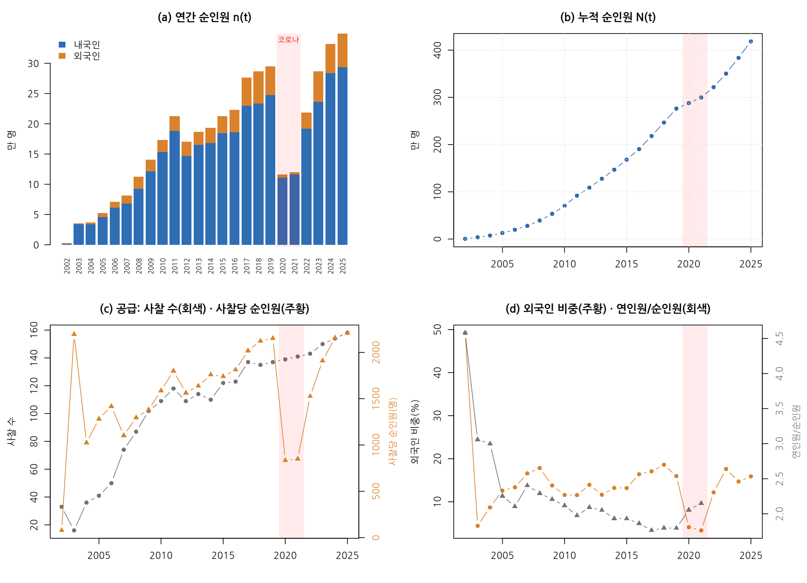

**발견 ① 아직 정점을 지나지 않았다**

- 누적값은 원래 줄어들 수 없으니, "누적이 늘고 있다"는 것만으로는 정점을 판단할 수 없습니다.
- 정점은 **해마다의 신규 참가자 수(누적 곡선의 기울기)**로 판단해야 합니다. 연간 순인원은 2025년(34.9만)이 역대 최대이고, 누적 곡선도 아직 가팔라지는 모양입니다.
- **한 해 줄었다고 정점은 아닙니다.** 2012년(−19.8%)과 2020년(−61%)의 감소는 모두 정점이 아니었습니다. 감소가 **계속되는지** 봐야 합니다.

**발견 ② 공급과 수요가 함께 움직였다**

- 2003→2019년 연평균 증가율은 참가자(순인원) 14.2%, 사찰 수 14.4%로 거의 같고, 두 계열의 상관은 r = .95입니다.
- 참가자 증가를 "사찰 수 증가 × 사찰당 참가자 증가"로 나눠 보면, 2005→2019년에 사찰 수는 약 3.3배, 사찰당 순인원은 약 1.7배(1,282명 → 2,152명) 늘었습니다. **증가의 큰 몫은 공급 확대**에서 왔고, 사찰당 수요도 함께 늘었습니다.
- 단, **어느 쪽이 원인인지는 알 수 없습니다.** 수요가 있어서 사찰이 참여했을 수도 있습니다.

**발견 ③ 공급이 멈추면 수요도 멈췄다**

2011~2016년 사찰 수는 118곳 → 123곳으로 사실상 멈췄고, 참가자도 21만 명 안팎에서 맴돌았습니다. 2017년 사찰이 14곳 늘자 참가자가 24% 뛰었습니다.

**발견 ④ 이상한 해**

2002년(월드컵 특수, 외국인 49%), 2012년(사찰 수 감소), 2020~2021년(코로나, −61%)

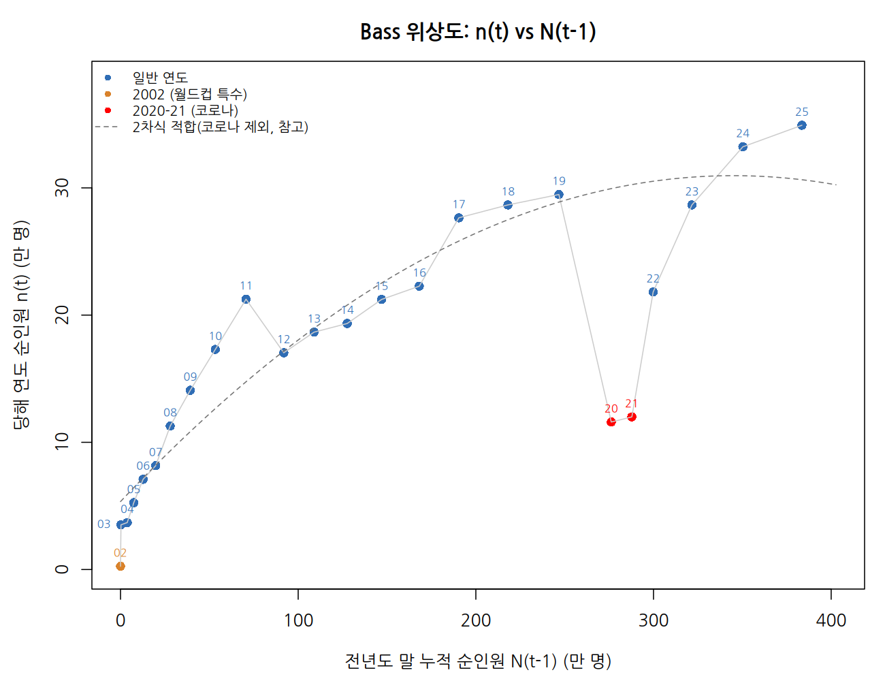

**위상도 읽는 법**

- 가로축은 작년까지의 누적, 세로축은 올해 신규입니다.
- Bass 모형이 맞다면 점들이 **뒤집힌 U자(포물선)** 위에 놓여야 합니다. 꼭짓점이 정점, 오른쪽 끝이 천장(m)입니다.
- 2019년까지는 점들이 포물선처럼 꺾이는 모양이었습니다. 코로나 연도를 빼고 그린 것이라 **코로나 탓은 아니고**, 상당 부분 **2011~2016년의 공급 정체**가 만든 모양일 수 있습니다.
- 코로나 이후 2022~2025년 점들은 그 곡선 위로 다시 올라갔습니다. 2010년대의 둔화를 "포화"의 신호로 보기 어렵게 만드는 대목입니다.

> **1단계 요약:** 자료는 아직 정점 전이고, 공급과 강하게 함께 움직입니다. 공급이 멈춘 시기의 둔화를 포화로 착각하지 않도록 조심해야 합니다.

---

### 5.3 2단계: 세 가지 방법으로 기본 추정

**알고 싶은 것:** 같은 자료에 계산 방법만 바꾸면 결과가 얼마나 달라지는가?

**설정:** 순인원 2002~2025, 코로나 포함, 아무것도 손대지 않은 기본형

| 방법 | p | q | m (표준오차) | 모형이 말하는 정점 | 2025년 도달률 | R² |
|---|---|---|---|---|---|---|
| OLS | .0086 | .131 | 734 (–) | 2020.6 | 57% | .63 |
| 누적 NLS | .0068 | .181 | 524 (±34) | 2018.5 | 80% | .59 |
| 증분 NLS | .0066 | .116 | 858 (±326) | 2024.3 | 49% | .68 |

**표 읽는 법:** m은 "앞으로 언젠가 참가할 총인원(만 명)", 도달률은 "모형이 보기에 그중 몇 %가 2025년까지 이미 참가했나"입니다.

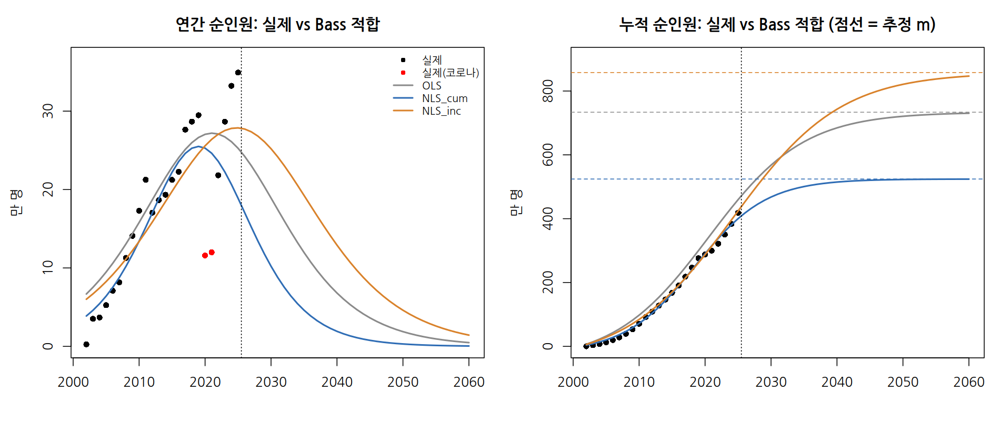
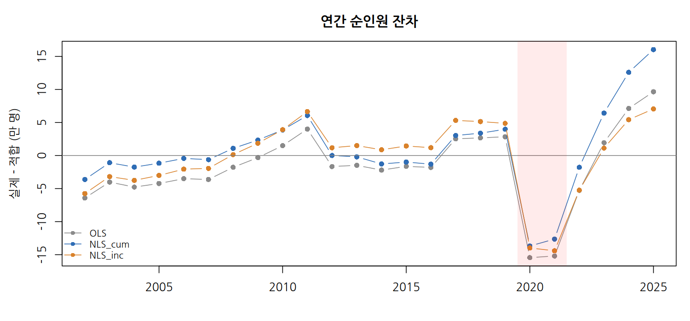

**해석**

1. **p와 q는 비슷한데 m이 크게 갈립니다.** 방법에 따라 천장이 524만~858만 명으로 달라집니다.
2. **q가 커 보이는 데는 함정이 있습니다.** q/p가 15~27로 입소문 효과가 강해 보이지만, Bass 모형에는 공급 변수가 없어서 **사찰 증가로 생긴 성장까지 입소문(q)이 떠안았을** 가능성이 큽니다. 6단계에서 확인합니다.
3. **m은 사실상 정해지지 않았습니다.** 증분 NLS의 m 표준오차가 326이라 95% 구간이 대략 200만~1,500만 명입니다. "천장이 200만일 수도, 1,500만일 수도 있다"는 뜻입니다. OLS에서도 곡선의 휘어짐을 나타내는 2차항이 유의확률 .098로 약합니다.
4. **누적 NLS의 작은 표준오차(±34)는 믿기 어렵습니다.** 4장에서 설명한 누적 자료의 자기상관 때문에 실제보다 작게 계산된 것입니다. 이 모형은 "2018년이 정점, 이미 80% 도달"이라고 하는데, 2024~2025년의 역대 최다 기록과 맞지 않습니다.
5. **오차에 일정한 패턴이 있습니다.** 초기에는 모든 모형이 실제보다 높게, 2022~2025년에는 모두 실제보다 낮게 예측했고 그 차이가 점점 커집니다. 실제 성장은 Bass 곡선보다 **완만하고 오래 이어지는** 모양이라는 뜻입니다.

> **2단계 요약:** 계산 방법에 따라 천장이 크게 달라지고, 어느 방법도 최근의 성장을 따라가지 못합니다.

---

### 5.4 3단계: 분석 설정을 바꿔 보기

**알고 싶은 것:** 분석자가 내리는 선택이 결과를 얼마나 바꾸는가?

**바꿔 본 선택**

- 출발 연도: 2002년(월드컵 특수 포함) vs 2003년
- 코로나 2020~2021년: ① 그대로 포함 ② 빼고 분석 ③ 더미 변수로 따로 처리

이렇게 2 × 3 = 6가지 설정으로 돌렸습니다.

| 방법 | 6가지 설정에서 m의 범위 | 정점 범위 |
|---|---|---|
| 누적 NLS | 509 ~ 547 | 2018년 |
| OLS | 724 ~ 789 | 2020~2022년 |
| 증분 NLS | 790 ~ 942 | 2022~2026년 |

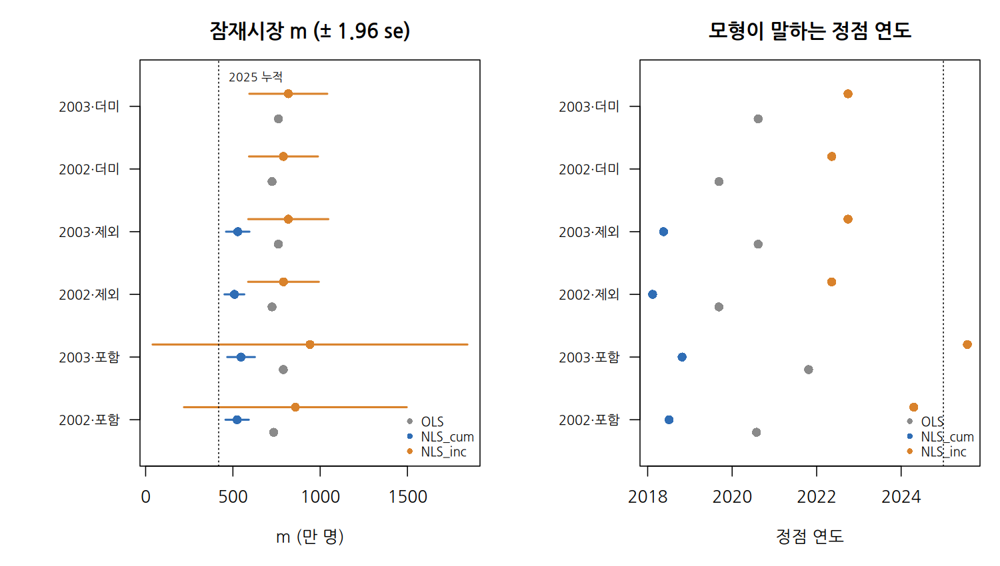
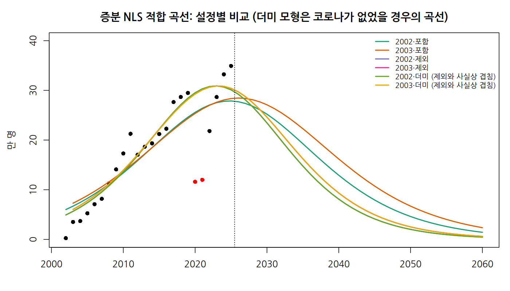

**해석**

1. **계산 방법의 선택이 설정의 선택보다 훨씬 중요합니다.** 설정을 바꾸면 m이 40만~150만 명 움직이지만, 방법을 바꾸면 300만~400만 명이 달라집니다.
2. **출발 연도의 영향은 작습니다.** 2002년 참가자가 0.26만 명뿐이라 모형에 주는 무게가 작습니다.
3. **코로나를 빼면 추정이 정밀해집니다.** 증분 NLS의 m 표준오차가 326에서 103으로 줄었습니다. 급감한 두 해가 곡선을 눌러 m을 흔들고 있었던 것입니다.
4. **더미로 처리한 결과는 빼고 분석한 결과와 거의 같습니다.** 더미를 넣으면 코로나 두 해는 자기만의 값을 갖게 되어 p·q·m 계산에 영향을 주지 않기 때문입니다. 더미가 잡아낸 코로나 효과는 OLS에서 약 −18만 명, 증분 NLS에서 약 61% 감소입니다.
   - 두 더미가 가정하는 상황은 다릅니다. OLS 더미는 "코로나로 못 온 사람이 잠재 참가자로 남아 있다"고 보고, 증분 NLS 더미는 "확산의 시계는 그대로 흐르고, 코로나로 사라진 참가자는 돌아오지 않는다"고 봅니다.
5. **어떤 설정도 핵심 문제를 풀지 못했습니다.** 모든 곡선이 2022~2023년 무렵 정점을 찍고 내려가는데, 실제 2024~2025년은 곡선보다 위에 있습니다. 문제는 자료 처리가 아니라 **모형의 구조**에 있습니다.

> **3단계 요약:** 설정을 바꿔서는 해결되지 않습니다. 모형 자체의 가정을 다시 봐야 합니다.

---

### 5.5 4단계: 예측 시험과 논문 재현

#### Part A. 처음 보는 기간을 맞히는가 (Holdout 검증)

두 번 시험했습니다.

- **시험 1:** 2015년까지 자료로 모형을 만들고 → 2016~2019년을 예측
- **시험 2:** 2019년까지 자료로 모형을 만들고 → 2022~2025년을 예측 (2020~2021년은 코로나라 채점에서 제외)

| 예측 방법 | 시험 1 오차 (MAPE) | 시험 2 오차 (MAPE) |
|---|---|---|
| OLS | 55.6% | 27.2% |
| 누적 NLS | 58.0% | 43.9% |
| 증분 NLS | 48.0% | 23.5% |
| **Naive** (작년 값 유지) | 20.5% | **16.2%** |
| **Drift** (최근 추세 연장) | **13.4%** | 33.2% |

(오차가 작을수록 좋습니다. 굵은 글씨가 각 시험의 1위)

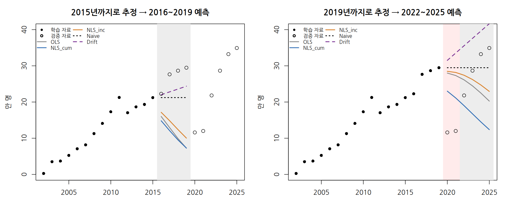

**해석**

1. **Bass 모형 세 가지가 모두 단순 예측에 졌습니다.**
2. **2015년까지의 자료로 만든 모형은 급감을 예측했습니다.** 이 모형이 추정한 천장(230만~257만 명)은 2019년 실제 누적(276만 명)보다도 작았습니다. 2011~2016년의 **공급 정체를 포화로 잘못 읽은** 결과입니다.
3. **Naive와 Drift의 순위가 뒤바뀐 이유:** 시험 2에서 두 방법 모두 코로나를 전혀 모르는 상태였습니다.
   - Drift는 코로나로 멈춘 기간에도 성장이 계속된다고 가정해서 **높게** 예측했습니다.
   - Naive는 코로나 이후 실적이 마침 2019년 수준(29.5만) 근처를 오가서 **운 좋게** 오차가 작았습니다.
   - 어느 벤치마크가 늘 더 좋은 것은 아닙니다. 둘 다 "복잡한 모형이 최소한 넘어야 할 기준선"입니다.

#### Part B. 논문은 어떻게 계산했나 (재현)

논문과 같은 **연인원** 자료(20년사 2002~2021 + 논문 표 1에서 역산한 2022년 43.0만, 2023년 54.6만)로 세 방법을 돌렸습니다.

| 추정 기간 | 논문 | **OLS (재현)** | 누적 NLS | 증분 NLS |
|---|---|---|---|---|
| 2002~2023 | m 907.5, p .01, q .18 | **m 908.0, p .012, q .179** | m 841 | m 972 |
| 2002~2019 | m 954.3 | **m 955.0** | m 805 | m 1,044 |

→ OLS의 결과가 논문과 거의 같습니다. **논문은 OLS(Bass 1969 방식)를 썼습니다.**

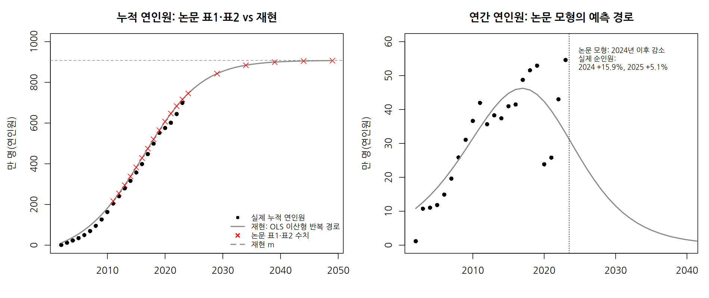

**논문의 예측값은 어떻게 만들어졌나**

- 논문 표 1(예측 누적)은 13개 연도 모두 0.2만 명 이내로, 표 2(2049년까지 예측)도 0.5만 명 이내로 재현됐습니다.
- 재현해 보니 논문의 "예측 누적"은 **누적 0에서 출발해 추정식을 매년 반복 적용해 만든 가상 경로**였습니다.

> **두 가지 예측 방식의 차이 (비유)**
> - **한 해씩 예측:** 매년 실제 위치를 확인하고, 거기서 1년 뒤를 예측합니다. 내비게이션이 매번 GPS로 현재 위치를 다시 잡는 것과 같습니다.
> - **0에서 출발한 가상 경로:** 출발점에서 방향과 속도만으로 계속 계산해 나갑니다. 초반에 조금만 어긋나도 오차가 계속 쌓입니다.

- **"13개 연도 모두 과대추정"의 원인:** 모형이 틀려서라기보다, 초기 몇 년의 과대추정이 가상 경로에 **계속 쌓여서** 이후 모든 연도로 이어진 것입니다. 논문 표 1의 오차(Diff %)는 모형의 정확도라기보다 **경로가 벗어난 정도**입니다.
- **논문 모형의 예측과 현실:** 논문 모형은 연간 연인원이 2023년 33.0만 → 2024년 29.4만 → 2025년 25.9만으로 **줄어든다**고 봤습니다. 실제 2023년 연인원은 이미 54.6만이었고, 순인원은 2024~2025년에 역대 최다를 경신했습니다.

> **4단계 요약:** 표준 Bass 모형은 "작년 값 그대로"라는 가장 단순한 예측도 이기지 못했습니다. 논문의 방법은 재현됐지만, 그 예측은 현실과 달랐습니다.

---

### 5.6 5단계: 자료가 쌓일수록 추정이 안정되는가 (Rolling origin)

**알고 싶은 것:** 해마다 새 자료가 들어올 때, 모형이 추정하는 천장(m)과 정점이 한 값으로 모이는가?

**방법:** 관측 끝 연도를 2008, 2009, …, 2025년으로 한 해씩 늘려 가며, 매번 2002년부터 그해까지의 자료로 다시 추정했습니다. (코로나 연도는 추정에서 빼므로 2020, 2021년 추정은 2019년과 같습니다.)

| 관측 끝 | 실제 누적 | 증분 NLS의 m | m ÷ 누적 | 모형이 말하는 정점 |
|---|---|---|---|---|
| 2011 | 92 | 357 | 3.9배 | 2014.1 |
| 2012 | 109 | 178 | 1.6배 | 2010.9 |
| 2016 | 190 | 301 | 1.6배 | 2013.7 |
| 2019 | 276 | 599 | 2.2배 | 2019.3 |
| 2025 | 418 | 790 | 1.9배 | 2022.4 |

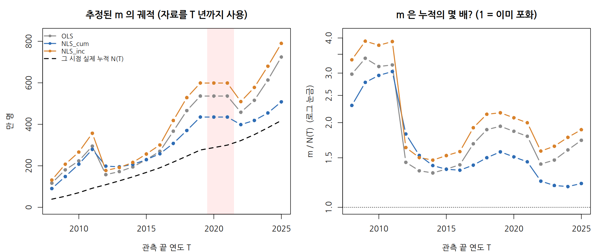
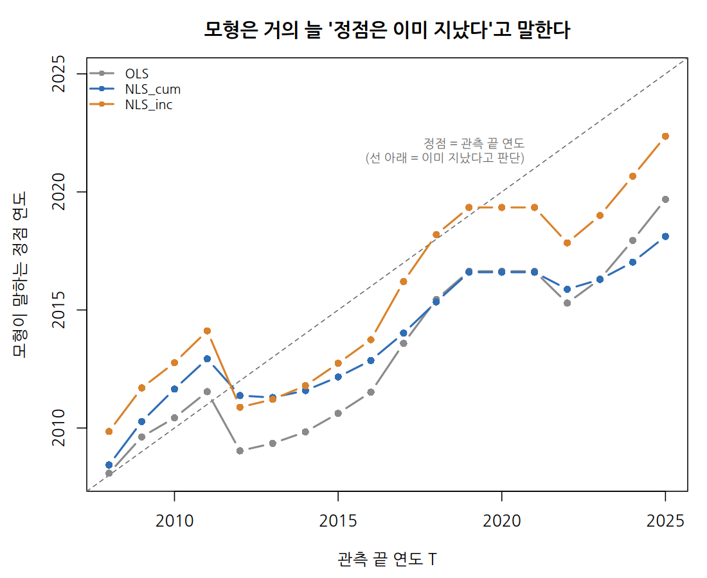
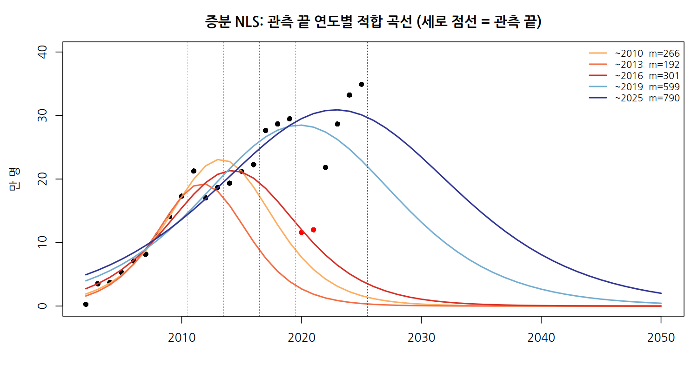

**해석**

1. **천장 m이 한 값으로 모이지 않고, 누적을 뒤쫓아 올라갑니다.** 좋은 모형이라면 자료가 쌓일수록 m이 어떤 값으로 안정되어야 합니다. 그런데 m은 계속 "그 시점 누적의 약 1.2~2배"를 따라 올라갔습니다. 2012년 한 해의 감소만으로 m이 357만에서 178만으로 반토막 나기도 했습니다.
2. **모형은 거의 늘 "정점은 이미 지났다"고 말합니다.** 정점 그래프에서 점들이 대각선("정점 = 관측 끝 연도") 아래에 있다는 것이 그 뜻입니다. 2025년까지의 자료로도 정점을 2018~2022년으로 보지만, 실제 연간 최대는 2025년입니다.
3. **"곧 감소"를 반복하다가 밀려납니다.** 각 시점의 곡선이 "지금이 정점 근처, 곧 감소"를 말하고, 새 자료가 들어오면 곡선이 오른쪽 위로 밀려나는 일이 반복됩니다.

**여러 번 시험한 예측 오차**

| 모형 | 1년 앞 오차 (15회 평균) | 3년 앞 오차 (13회 평균) |
|---|---|---|
| OLS | 22.1% | 41.8% |
| 누적 NLS | 30.6% | 43.9% |
| 증분 NLS | 20.3% | 38.7% |
| **Naive** | 14.7% | **30.3%** |
| **Drift** | **13.3%** | 36.2% |

1년 앞 예측에서 가장 정확했던 횟수는 Naive 6회, Drift 4회, OLS 3회, 누적 NLS 2회였습니다. 여러 번 시험해도 4단계와 같은 결론이므로, **4단계 결과는 운이 아니었습니다.**

> **5단계 요약:** 자료가 쌓여도 천장 추정이 안정되지 않고, 모형은 매번 "포화가 임박했다"고 잘못 말합니다. 이것은 가정(고정된 천장)이 자료와 맞지 않는다는 강한 신호입니다.

---

### 5.7 6단계: 공급을 반영한 모형과 정책 시나리오

**알고 싶은 것:** "사찰 수를 그대로 두면 수요는 어디서 멈추고, 사찰을 늘리면 그 천장이 얼마나 올라가는가?"

#### 세 모형 비교 (순인원, 코로나 제외)

| 모형 | 가정 | p | q | 잠재시장 | 오차(RSS) |
|---|---|---|---|---|---|
| M0 고정 m | 천장은 일정 | .007 | .156 | 724만 | 230 |
| **M1 동적 m** | **천장 = k × 사찰 수** (공급이 천장을 올림) | .019 | **.099** | **k = 5.75만/곳 (±1.75)** | **114** |
| M2 GBM | 사찰 수 증가율이 확산 속도를 올림 | .006 | .129 | 892만, β = .08 | 230 |

(공정한 비교를 위해 같은 형태끼리 비교했습니다: M0 vs M1은 "한 해씩" 형태, 증분 NLS(230) vs M2(230)는 곡선 형태)

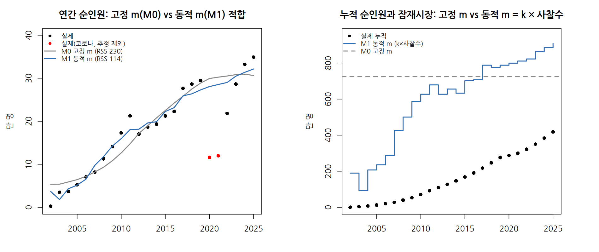

**해석**

1. **공급은 확산의 "속도"보다 "천장"을 올립니다.** 천장이 사찰 수에 따라 올라가게 한 M1은 오차를 절반(230 → 114)으로 줄였습니다. 반면 속도를 조절하게 한 M2는 효과를 나타내는 β가 0에 가까워 개선이 없었습니다.
2. **입소문 효과(q)가 .156에서 .099로 줄었습니다.** 2단계에서 의심했던 대로, 입소문처럼 보이던 성장의 상당 부분이 사실은 공급 확대의 효과였습니다.
3. **k = 5.75만 명은 "사찰 1곳이 떠받치는 잠재 참가자 규모"**입니다. 2025년 사찰 158곳 기준으로 천장은 약 909만 명이고, 지금까지의 누적 418만 명은 그 46%입니다. 1단계에서 본 "아직 정점 전"이라는 판단과 맞습니다.
4. **예측력은 좋아졌지만 아직 Naive에는 못 미칩니다.** 1년 앞 예측 오차는 고정 m 24.6%, 동적 m 17.4%, Naive 14.0%입니다. 게다가 이 결과는 **다음 해 실제 사찰 수를 미리 안다고 가정한** 조건부 예측입니다.

#### 정책 시나리오 (2026~2035년, M1 기준)

| 시나리오 | 가정 | 2035년 사찰 | 2030년 연간 참가자 | 2035년 연간 참가자 | 2035년 누적 |
|---|---|---|---|---|---|
| 동결 | 158곳 유지 | 158곳 | 28.8만 (21.6~35.1) | 21.9만 (12.1~33.6) | 695만 |
| 추세 | 2015~2025 평균, 매년 +3.6곳 | 194곳 | 33.8만 (28.0~38.9) | 33.0만 (24.1~42.7) | 753만 |
| 확대 | 매년 +6곳 | 218곳 | 36.9만 (31.8~41.4) | 39.7만 (31.5~48.5) | 788만 |

괄호 안은 **80% 부트스트랩 구간**입니다. 모형의 오차를 무작위로 다시 뽑아 가상 자료를 300번 만들고, 매번 다시 추정·예측한 결과의 10~90% 범위입니다. "10번 중 8번은 이 범위 안에 든다" 정도로 읽으면 됩니다.

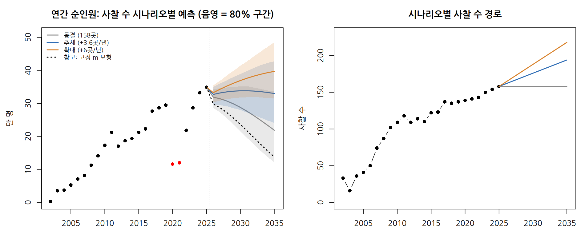

**동결 대비 공급 확대 효과**

- 추세: 2035년까지 +36곳 → 10년 누적 +57.8만 명, 2035년 연간 +11.1만 명
- 확대: 2035년까지 +60곳 → 10년 누적 +93.1만 명, 2035년 연간 +17.8만 명 (사찰 1곳당 연 약 3,000명)

> **"사찰 1곳당 연 약 3,000명"을 읽을 때 주의하세요.**
> 이 숫자는 **새 사찰 한 곳이 모으는 참가자 수가 아닙니다.** 비교 기준인 "동결" 시나리오는 천장에 다가가며 참가자가 **줄어드는** 경로입니다. 그래서 이 효과에는 "새 참가자" 몫과 함께 **"줄어들 수요를 막은 몫"**이 섞여 있고, 현재 사찰당 평균(2,210명)보다 크게 나옵니다. 보고서에는 "공급을 늘리지 않을 때의 감소를 포함한 차이"로 표현해야 합니다.

#### 민감도 분석: 사찰을 늘려도 질이 떨어진다면?

M1 모형은 **새 사찰도 기존 사찰과 똑같은 크기의 시장을 연다**고 가정합니다. 현실에서는 그렇지 않을 수 있어서, 이 가정이 깨지는 두 가지 경우를 넣어 봤습니다.

- **α (신규 사찰 효율):** 새 사찰이 기존 사찰의 몇 %만큼 시장을 여는가. α = 0.5면 기존의 절반
- **q 배수 (입소문 변화):** 새 사찰의 만족도가 낮아 부정적 입소문이 **템플스테이 전체**의 입소문 효과를 약하게 만드는 경우. 새 사찰이 늘어나는 만큼 점차 떨어져 2035년에 해당 배수에 이른다고 가정. q 배수 0.8이면 입소문 효과가 20% 약해짐

**확대 시나리오의 10년 누적 효과 (동결 대비, 만 명)**

| q 배수 \ α | 1.0 | 0.75 | 0.5 | 0.25 |
|---|---|---|---|---|
| 1.0 (변화 없음) | 93.1 | 71.3 | 48.6 | 24.9 |
| 0.9 | 78.9 | 58.2 | 36.7 | 14.3 |
| 0.8 | 64.7 | 45.1 | 24.7 | 3.5 |

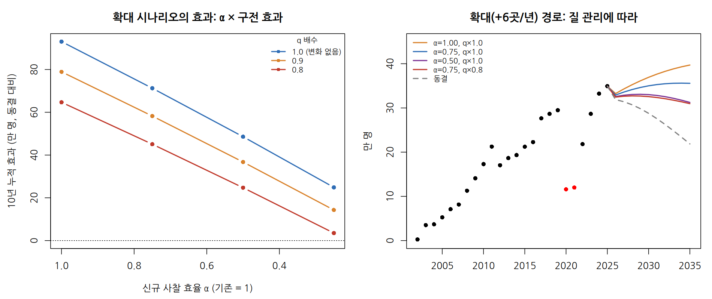

**해석**

- **α가 효과 크기를 거의 비례적으로 좌우합니다.** 새 사찰의 효율이 절반이면 효과도 약 절반입니다.
- **입소문이 20% 약해지면 효과가 추가로 크게 줄어듭니다.** 효율 절반(α = 0.5)에 입소문 20% 약화가 겹치면 효과는 93.1만에서 24.7만으로 줄어듭니다. **질 관리 실패가 사찰 수 부족보다 더 큰 손실**이 될 수 있습니다.
- **효과는 시간이 지나야 드러납니다.** 질 관리가 되지 않은 확대 경로는 2030년대 초까지 동결과 거의 비슷하게 움직입니다. 정책을 몇 년 만에 평가하면 효과를 놓칠 수 있습니다.
- q가 얼마나, 어떤 속도로 떨어질지는 가정입니다. 이 표는 "이 정도면 이만큼 줄어든다"를 보는 **범위 확인용**입니다.

> **6단계 요약:** 공급을 천장에 반영하자 모형이 자료에 훨씬 잘 맞았고, "수요는 공급 정책과 그 질에 달려 있다"는 그림이 나왔습니다.

---

## 6. 종합 결론과 교훈

### 6.1 분석 전체를 한 문단으로

공급 확대와 재참가로 계속 성장하는 자료에 기본 Bass 모형을 적용하면, 모형은 **작은 둔화가 올 때마다 포화로 읽어서 천장을 낮게, 정점을 이르게** 추정합니다. 새 자료가 들어오면 천장과 정점을 뒤로 미루는 일을 반복합니다. 공급을 천장에 반영하면 "수요는 이미 포화 중"이 아니라 **"수요는 공급 정책과 그 질에 달려 있다"**는 전혀 다른 그림이 나옵니다.

### 6.2 기본 Bass 모형의 가정과 템플스테이의 현실

| 모형의 가정 | 템플스테이 자료 | 결과에 미친 영향 |
|---|---|---|
| 한 사람은 한 번만 채택 | 재참가가 있음 (순인원도 해마다 새로 셈) | 포화가 늦게 오고, 천장의 의미가 모호해짐 |
| 천장 m은 고정 | 사찰 수·프로그램이 늘며 시장이 커짐 | 천장 과소추정, 너무 이른 포화 판단 |
| 공급 제약 없음 | 사찰 수용 능력이 참가자를 제한 | 공급 정체기를 포화로 착각, 입소문 효과 과대추정 |
| p·q는 일정 | 코로나, 외국인 유입, 정책 변화 | 추정 불안정 |

### 6.3 이 실습에서 얻는 교훈

1. **자료의 정의부터 확인하세요.** "무엇을 셌는가(순인원/연인원)"를 확인한 것만으로 논문과 숫자가 다른 이유가 풀렸습니다.
2. **계산 방법을 하나만 쓰지 마세요.** 방법에 따라 천장이 300만~400만 명씩 달라졌습니다.
3. **이미 있는 자료를 잘 설명하는 것과 미래를 맞히는 것은 다릅니다.** 반드시 처음 보는 기간으로 시험하고, 단순 예측(Naive, Drift)과 비교하세요.
4. **모형이 매번 같은 방향으로 틀리면 가정을 의심하세요.** "곧 포화"를 반복하다 밀려나는 패턴은 천장이 고정되어 있다는 가정이 틀렸다는 신호였습니다.
5. **모든 모형은 틀립니다. 다만 일부는 유용합니다**(George Box). 물어야 할 것은 "이 모형이 맞는가"보다 **"이 모형의 가정이 내 자료와 얼마나 다르고, 그 차이가 결론을 어느 방향으로 비트는가"**입니다. 방향을 알면 결과를 보정해서 읽을 수 있습니다. 예를 들어 "천장은 최소한 이 정도 이상일 것"처럼요.

---

## 7. 정책에 주는 시사점

1. **"수요가 언제 포화되는가"보다 "공급을 늘리면 수요가 얼마나 생기는가"가 핵심 질문입니다.** 동적 m 모형은 이 질문에 숫자로 답할 수 있는 출발점을 줍니다.
2. **공급의 양만큼 질이 중요합니다.** 새 사찰의 효율(α)과 입소문 효과(q)를 지켜볼 지표가 필요합니다.
   - α를 가늠하는 지표: 신규 사찰의 사찰당 참가자 수
   - q를 가늠하는 지표: 만족도 조사의 추천 의향, 재참가 의향
3. **인과는 따로 검증해야 합니다.** 이번 분석은 사찰 수와 수요가 **함께 움직였다**는 것을 모형으로 표현한 것이지, 사찰을 늘리면 수요가 늘어난다는 것을 **증명**한 것은 아닙니다. 사업 효과를 엄밀히 평가하려면 사찰별·지역별 자료로 신규 운영 전후를 비교하는 **이중차분법(DID)** 같은 설계가 필요합니다.
4. **조사 자료로 모형의 약점을 보완할 수 있습니다.** 참가자 만족도 조사에 "재참가 여부" 문항이 있다면, **연간 순인원 × (1 − 재참가 비율)**로 처음 참가한 사람 수를 근사할 수 있습니다. 그러면 "한 사람은 한 번만"이라는 모형의 가정에 더 가까운 자료가 됩니다.

---

## 8. 내 자료에 적용할 때: 체크리스트와 함정

### 8.1 단계별 체크리스트

**① 분석 전: 자료 점검**

- [ ] **무엇을 셌는가?** 사람 수인가, 건수·연인원인가? 모형의 "채택자" 개념과 맞는가?
- [ ] **재구매·재방문이 섞여 있는가?** 섞여 있다면 m은 "채택자 규모"가 아니라 "포화 전까지 쌓일 규모"로 해석한다.
- [ ] **출처가 여러 개라면 겹치는 기간으로 교차 검증했는가?** 합계·누적이 맞는지, 내역의 합이 합계와 같은지 확인한다.
- [ ] **도입 초기부터 관측됐는가?** 앞부분이 잘렸다면 도입 시점과 관측 직전 누적값을 확보한다.
- [ ] **이상 연도**(특수 이벤트, 외부 충격)를 표시해 두었는가?
- [ ] **공급·가격·정책 변수**를 함께 확보했는가? (매장 수, 요금, 예산 등)

**② 모형 전에 그림부터**

- [ ] 연간값과 누적값 그래프: 연간값이 정점을 지났는가? 감소가 **계속되는가**?
- [ ] **위상도:** 뒤집힌 U자가 보이는가? 오른쪽 끝(천장)을 자료가 직접 보여 주는가?
- [ ] 공급 변수와 수요를 겹쳐 그려 보고, "공급 × 공급 단위당 수요"로 나눠 본다.

**③ 추정: 최소 세 가지 방법을 나란히**

- [ ] **OLS, 누적 NLS, 증분 NLS**를 모두 돌려 천장과 정점이 얼마나 갈리는지 본다.
- [ ] **표준오차**를 확인한다. m의 표준오차가 추정값의 절반을 넘으면 "천장은 정해지지 않았다"고 보고한다.
- [ ] 누적 NLS의 작은 표준오차는 그대로 믿지 않는다.
- [ ] NLS는 **여러 시작값**으로 돌린다.
- [ ] **잔차 그림**에서 오차가 한쪽으로 몰리는지 확인한다.

**④ 설정 바꿔 보기**

- [ ] 출발 연도, 외부 충격 처리(포함/제외/더미)를 바꿔도 결론이 유지되는지 확인한다.
- [ ] 방법 간 차이와 설정 간 차이 중 어느 쪽이 더 큰지 본다.

**⑤ 검증: 반드시 처음 보는 기간으로**

- [ ] 최근 몇 년을 숨기고 맞히는지 본다 (holdout).
- [ ] 예측 시작 시점을 옮겨 가며 반복한다 (rolling origin).
- [ ] **Naive, Drift와 비교**한다. 이기지 못하면 "점 예측 도구로는 부적합"이라고 보고한다.
- [ ] 예측치가 **실제값에서 한 해씩 예측한 것**인지, **0에서 출발한 가상 경로**인지 구분해 보고한다.

**⑥ 확장과 시나리오**

- [ ] 공급·마케팅 변수가 있다면 **동적 m**과 **GBM**을 모두 시험해, 공급이 "천장"을 올리는지 "속도"를 올리는지 본다.
- [ ] 정책 시나리오는 **동결(기준) 대비 차이**로 제시하고, 그 차이에 "감소 방지 몫"이 섞였는지 설명한다.
- [ ] 핵심 가정(공급 단위 효율, 입소문 효과)에 **민감도 분석**을 붙인다.
- [ ] 불확실성 구간(부트스트랩 등)을 함께 제시한다.

### 8.2 자주 빠지는 해석의 함정

| 함정 | 왜 문제인가 | 이번 사례 |
|---|---|---|
| "누적이 계속 늘어나니 아직 성장 중" | 누적은 원래 줄지 않는다. 정점은 **연간값**으로 판단해야 한다 | 1단계 |
| "한 해 줄었으니 정점을 지났다" | 일시적 감소일 수 있다. 감소가 **계속되는지** 봐야 한다 | 2012년, 2020년 |
| "R²가 높으니 예측도 잘할 것" | 이미 있는 자료를 잘 설명하는 것과 미래를 맞히는 것은 다르다 | Bass가 Naive에 짐 |
| "q가 크니 입소문 효과가 강하다" | 공급 확대 효과를 q가 떠안았을 수 있다 | q .156 → .099 |
| "표준오차가 작으니 정확하다" | 누적값에 맞추면 표준오차가 실제보다 작게 나온다 | 누적 NLS |
| "모든 연도에서 과대추정 = 모형이 편향됨" | 0에서 출발한 가상 경로라서 초기 오차가 쌓인 것일 수 있다 | 논문 표 1 |
| "사찰 1곳 추가 = 연 3,000명 추가" | 기준 시나리오의 감소 방지 몫이 섞여 있다 | 6단계 |
| "공급과 수요가 같이 움직였으니 공급이 수요를 만든다" | 반대 방향일 수도 있다. 관측 자료만으로 인과를 단정할 수 없다 | 전 과정 |

---

## 9. 결과를 보고하는 법

### 9.1 표현 원칙

| 피해야 할 표현 | 권장 표현 |
|---|---|
| 잠재시장은 734만 명이다 | 추정 방법에 따라 잠재시장은 524만~858만 명으로 추정되어, 규모를 특정하기 어렵다 |
| 2020년이 수요의 정점이다 | 기본 Bass 모형은 2018~2024년을 정점으로 추정했으나, 실제 연간 참가자는 2025년이 최대였다 |
| 모형의 설명력이 높아 예측이 신뢰할 만하다 | 표본 밖 검증에서 모형의 예측 오차는 ○○%로, 단순 예측(Naive ○○%)보다 컸다 |
| 사찰을 늘리면 수요가 늘어난다 | 사찰 수와 수요는 함께 움직였으며, 사찰 수를 반영한 모형에서 공급 확대 시나리오의 수요가 더 높게 나타났다 (인과는 별도 검증 필요) |
| 사찰 1곳당 연 3,000명이 늘어난다 | 동결 대비 확대 시나리오의 차이는 사찰 1곳당 연 약 3,000명이며, 여기에는 동결 시의 수요 감소를 막은 몫이 포함된다 |

### 9.2 보고서에 담을 내용

1. 자료의 정의(순인원/연인원 등)와 출처, 정정 사항
2. 추정 방법과 예측치 계산 방식 (한 해씩 예측인지, 가상 경로인지)
3. 표준오차 또는 불확실성 구간
4. 표본 밖 검증 결과와 벤치마크 비교
5. 모형 가정과 자료의 차이, 그 차이가 결론을 어느 방향으로 비트는지
6. 인과를 증명하지 않았다는 점

---

## 10. 파일 구성과 실행 방법

### 10.1 폴더 구성

```
BassModel/
├─ templestay_2002to2025.csv        # 통합 자료 (순인원 2002~2025, 연인원 2002~2021, 사찰 수)
├─ bass_functions.R                 # 공용 함수 (각 스크립트가 불러 씀. 따로 실행할 필요 없음)
├─ 01_data_explore.R                # 1단계: 자료 살펴보기
├─ 02_bass_fit.R                    # 2단계: 세 가지 추정법
├─ 03_specification.R               # 3단계: 설정 비교
├─ 04_forecast_validate.R           # 4단계: 예측 시험, 논문 재현
├─ 05_rolling_origin.R              # 5단계: rolling origin
├─ 06_supply_scenarios.R            # 6단계: 공급 반영 모형, 시나리오, 민감도
├─ Bass확산모형_분석가이드_템플스테이.md   # 이 문서
└─ out/                             # 모든 그래프(PNG)와 결과표(CSV)
```

### 10.2 실행 방법

1. R(4.2 이상 권장)을 열고 작업 폴더를 지정합니다.
   ```r
   setwd("내려받은/폴더/경로/bass-diffusion")
   ```
2. 단계별 스크립트를 순서대로 실행합니다. **추가 패키지가 필요 없습니다**(base R만 사용).
   ```r
   source("01_data_explore.R")
   source("02_bass_fit.R")
   # ... 06까지
   ```
3. 결과는 콘솔에 표로 나오고, 그래프와 CSV는 `out/` 폴더에 저장됩니다.

### 10.3 다른 자료에 적용하려면

- `bass_functions.R`의 `load_templestay()`를 참고해, **연도(year), 연간값, 공급 변수**가 있는 CSV를 읽는 함수를 만듭니다. 모형은 연간값을 `n`, 누적을 `N`, 도입 후 연차를 `t` 열로 사용합니다.
- 단위를 맞춰 주세요(이번 분석은 만 명). 숫자가 너무 크거나 작으면 NLS 계산이 수렴하지 않을 수 있습니다.
- 공급 변수가 있다면 `06_supply_scenarios.R`의 `S` 열(사찰 수) 자리에 넣으면 됩니다.

### 10.4 주요 함수 (`bass_functions.R`)

| 함수 | 역할 |
|---|---|
| `bass_F(t, p, q)` | 누적 채택 비율 F(t) |
| `bass_N(t, p, q, m)` / `bass_n(t, p, q, m)` | 누적 / 연간 채택자 |
| `bass_peak(p, q, m)` | 정점 시점·규모·누적 비율 |
| `fit_ols(d)` | OLS 추정 (`covid_dummy = TRUE`로 더미 추가 가능) |
| `fit_nls_cum(d)` / `fit_nls_inc(d)` | 누적 NLS / 증분 NLS (다중 시작점) |
| `fit_nls_inc_dummy(d)` | 증분 NLS + 코로나 더미 |
| `summarise_fit(r, d, t0)` | 추정 결과 요약 (정점, 도달률, RMSE, R²) |

---

## 11. 자주 묻는 질문

**Q1. p와 q는 각각 어느 정도면 큰 건가요?**
여러 제품의 평균은 대략 p ≈ 0.03, q ≈ 0.38입니다. 보통 q가 p보다 훨씬 커서, q/p가 클수록 입소문 중심의 S자 확산입니다. 다만 이번 사례처럼 공급 확대 같은 다른 요인이 q에 섞여 들어갈 수 있으니, 숫자 자체보다 **무엇이 섞였을지**를 먼저 생각하세요.

**Q2. 왜 계산 방법마다 천장(m)이 이렇게 다른가요?**
정점을 지나지 않은 자료에서는 곡선의 오른쪽 끝(천장)을 자료가 직접 보여 주지 않습니다. 천장은 곡선이 휘어지는 정도로부터 **추측**해야 하는데, 방법마다 그 휘어짐을 다르게 읽기 때문입니다. 방법마다 결과가 크게 다르다면 그 자체가 "천장을 알 수 없다"는 정보입니다.

**Q3. 단순 예측(Naive)에 졌는데 Bass 모형을 왜 쓰나요?**
점 예측(내년에 정확히 몇 명)에는 약할 수 있지만, 확산 구조를 해석하거나(광고 vs 입소문), 시나리오를 비교하거나, 자료가 없는 신제품을 예측하는 데는 여전히 유용합니다 (3.4 참고). 다만 **점 예측 용도로 쓰려면 반드시 벤치마크를 이겨야 합니다.**

**Q4. 재구매·재참가가 섞인 자료는 아예 쓸 수 없나요?**
쓸 수는 있지만 해석을 바꿔야 합니다. m은 "채택할 사람 수"가 아니라 "포화 전까지 쌓일 규모"가 됩니다. 조사 자료로 재참가 비율을 알 수 있다면 처음 참가자만 근사해서 쓰는 방법도 있습니다 (7장 4번).

**Q5. 코로나 같은 충격 기간은 어떻게 처리하나요?**
① 포함, ② 제외, ③ 더미 변수 세 가지를 모두 돌려 결론이 같은지 보세요. 이번 사례에서는 제외와 더미가 거의 같은 결과를 줬고, 포함하면 추정이 불안정해졌습니다.

**Q6. 부트스트랩 구간은 어떻게 읽나요?**
"모형 추정이 이만큼 흔들린다면 예측은 이 범위에서 움직인다"는 뜻입니다. 80% 구간은 "10번 중 8번은 이 범위"로 읽으면 됩니다. 다만 모형의 가정 자체가 틀렸을 때의 불확실성까지 담지는 못합니다.

**Q7. 정책 효과를 정확히 알려면 무엇이 더 필요한가요?**
이번 분석은 "함께 움직였다"를 모형화한 것입니다. "사찰을 늘렸기 때문에 늘었다"를 확인하려면, 사찰별·지역별 자료로 신규 사찰이 생긴 곳과 그렇지 않은 곳의 전후 변화를 비교하는 **이중차분법(DID)** 같은 방법이 필요합니다.

---

## 12. 참고문헌

- 강문영 (2024). Bass 확산 모형을 기반으로 한 템플스테이 수요 예측. *상품학연구*, 42(5), 35–39.
- 한국불교문화사업단 (2022). 『템플스테이 20년사』.
- 연합뉴스 (2026). 템플스테이 참가자 현황 표 (한국불교문화사업단 제공), 기사 AKR20260115161800005.
- Bass, F. M. (1969). A new product growth for model consumer durables. *Management Science*, 15(5), 215–227.
- Bass, F. M., Krishnan, T. V., & Jain, D. C. (1994). Why the Bass model fits without decision variables. *Marketing Science*, 13(3), 203–223.
- Heeler, R. M., & Hustad, T. P. (1980). Problems in predicting new product growth for consumer durables. *Management Science*, 26(10), 1007–1020.
- Lenk, P. J., & Rao, A. G. (1990). New models from old: Forecasting product adoption by hierarchical Bayes procedures. *Marketing Science*, 9(1), 42–53.
- Lilien, G. L., Rao, A. G., & Kalish, S. (1981). Bayesian estimation and control of detailing effort in a repeat purchase diffusion environment. *Management Science*, 27(5), 493–506.
- Mahajan, V., & Peterson, R. A. (1978). Innovation diffusion in a dynamic potential adopter population. *Management Science*, 24(15), 1589–1597.
- Rogers, E. M. (1962). *Diffusion of Innovations*. New York: Free Press.
- Srinivasan, V., & Mason, C. H. (1986). Nonlinear least squares estimation of new product diffusion models. *Marketing Science*, 5(2), 169–178.
- Sultan, F., Farley, J. U., & Lehmann, D. R. (1990). A meta-analysis of applications of diffusion models. *Journal of Marketing Research*, 27(1), 70–77.


