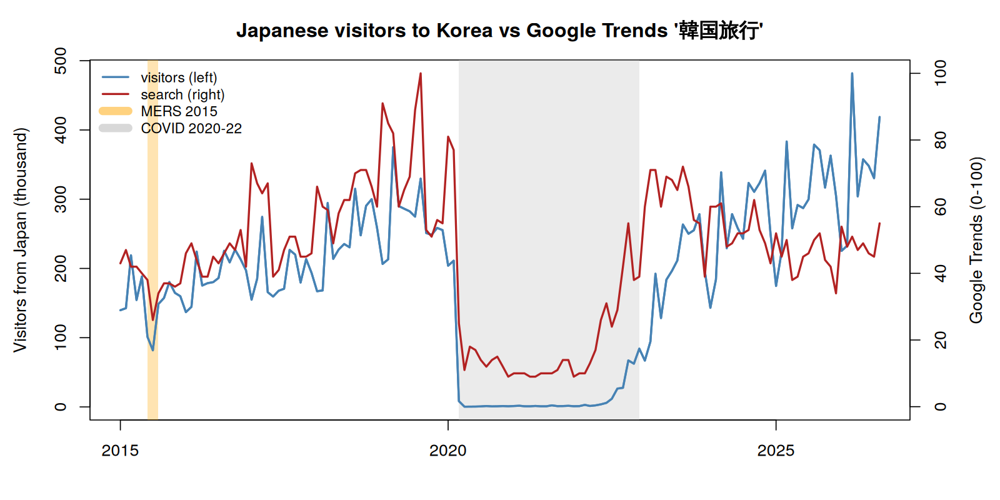
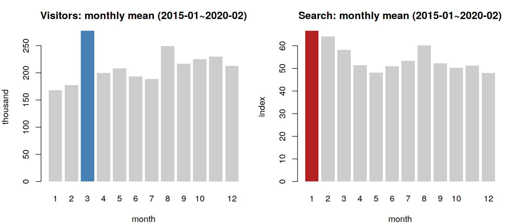
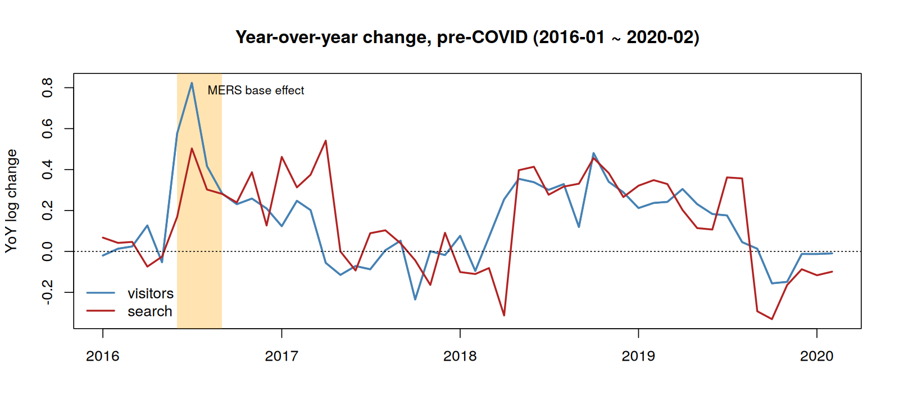
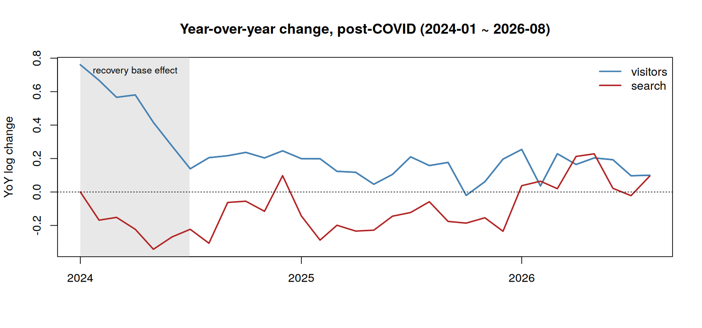
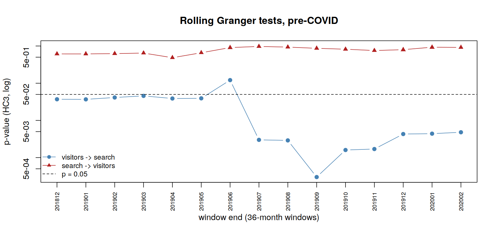
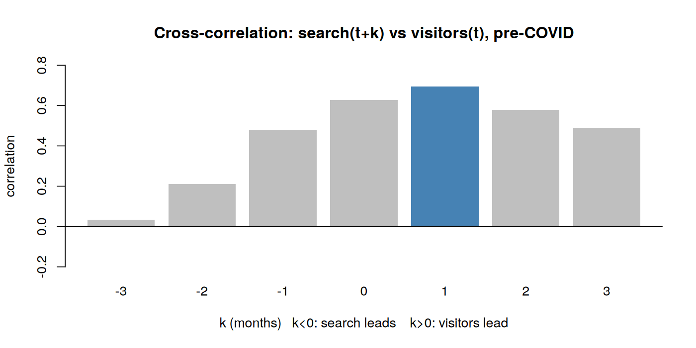

::: {.callout-note appearance="simple"}
**코드와 데이터:** [스크립트 보기](code.qmd) · [전체 내려받기 (zip)](files/granger-tourism-japan.zip)
:::

> **함께 보는 파일:** [`02_japan_tourism_granger.R`](code.qmd) (이 문서의 6장은 이 스크립트를 절 순서대로 따라갑니다)  
> **자료:** [`일본_관광객수_구글트렌드_201501to202608.xlsx`](files/일본_관광객수_구글트렌드_201501to202608.xlsx)  
> **대상:** 회귀분석과 p값 정도는 알지만, 시계열 분석은 처음이거나 익숙하지 않은 분  
> **이전 실습:** [그레인저 인과 검정 입문 가이드](../granger-causality/index.qmd) (닭과 달걀 사례). 읽지 않았어도 이 문서만으로 따라올 수 있도록 핵심 개념을 2장에 다시 정리했습니다.  

---


## 1. 한 페이지 요약

### 무엇을 물었나

> 일본에서 "韓国旅行(한국 여행)" 구글 검색이 늘면, 몇 달 뒤 한국을 찾는 일본인 관광객도 늘어날까?

검색량이 방문을 미리 알려 주는 **선행지표**가 될 수 있는지 확인하려는 질문입니다.

### 무엇을 알게 됐나

| 질문 | 답 |
|---|---|
| 검색이 방문을 선행하는가? | **아니요.** 1\~6개월 어떤 시차에서도 그런 흔적이 없었습니다. |
| 반대로 방문이 검색을 선행하는가? | **예 (코로나 이전).** 방한객이 늘어난 달의 다음 달에 검색이 늘어나는 관계가 여러 점검에서 일관되게 나타났습니다. |
| 코로나 이후는? | **판단할 수 없습니다.** 관측 기간이 짧고, 코로나 회복기의 착시가 커서 결론을 내리기 어렵습니다. |
| 분석하며 새로 알게 된 것 | 코로나뿐 아니라 **2015년 메르스 사태**도 영향을 끼치고 있었습니다. |

### 왜 예상과 반대일까 (8장에서 자세히)

- 일본처럼 한국 여행 경험이 많은 나라에서 **"한국 여행"이라는 넓은 검색어는 실제 여행 계획보다 막연한 관심을 반영**할 가능성이 큽니다. 실제로 여행을 준비하는 사람은 "서울 숙박", "성수동 가볼 만한 곳"처럼 구체적으로 검색합니다.
- 방문이 늘면 후기·SNS·입소문이 늘고, 그것이 다시 검색으로 이어질 수 있습니다.
- 여행 정보를 찾는 경로 자체가 구글에서 SNS로 옮겨 가고 있을 수 있습니다. (실제로 이렇다면 구글 트렌드 검색량 활용의 의미가 퇴색될 수 있습니다.)

### 가장 중요한 교훈

> **자료가 무엇을 측정하고 있는지가 결론을 좌우합니다.**  
> 같은 "검색량"이라도 나라와 시기에 따라 "여행 의향"을 측정하기도 하고 "막연한 관심"을 측정하기도 합니다. → 따라서 분석하고자 하는 **지표의 의미**부터 따져 봐야 합니다.

---

## 2. 그레인저 인과, 핵심만 다시 보기

### 2.1 한 문장 정의

> **Y 자신의 과거만으로 Y를 예측할 때보다, X의 과거까지 함께 쓸 때 Y를 통계적으로 유의하게 더 잘 예측할 수 있다면, "X는 Y를 그레인저 인과한다"고 말한다.**  

### 2.2 이 실습에 대입하면

다음 달 방한객 수(Y)를 예측한다고 해 봅시다.

- **방법 A (제약모형):** 지난달까지의 방한객 수만 보고 예측
- **방법 B (비제약모형):** 지난달까지의 방한객 수 + 지난달까지의 검색량으로 예측

방법 B가 A보다 **확실하게** 더 정확하면, "검색량은 방한객 수를 그레인저 인과한다"고 말합니다. 
방향을 바꿔서, 검색량(Y)을 예측하는 데 방한객 수(X)가 도움이 되는지도 똑같이 검정합니다(**양방향 검정**).

"확실하게"는 **F검정**으로 판단합니다. 방법 B에서 X의 과거 값들의 계수가 "모두 동시에 0"이라는 가설을 검정하고, p값이 0.05보다 작으면 "X가 도움이 된다"고 봅니다.

### 2.3 "인과"라는 이름에 속지 마세요

그레인저 인과는 일상적 의미의 원인-결과를 증명하지 않습니다. 정확히는 **"X가 먼저 움직이고, 그 움직임이 Y를 예측하는 데 쓸모 있는 정보를 담고 있다"**는 뜻입니다. 이 문서에서는 이것을 **"정보적 선행"**이라고 부릅니다.

| 흔한 오해 | 실제 의미 |
|---|---|
| 방문이 검색의 원인이다 | 방문의 변화가 검색의 변화보다 먼저 나타나고, 검색 예측에 도움이 된다 |
| 검색은 방문에 영향이 없다 | 이 자료와 이 주기(월 단위)로는 검색이 방문을 선행하는 증거가 확인되지 않았다 |

### 2.4 이 실습에 필요한 조건

- 시점이 충분히 많아야 합니다 (최소 50개, 가능하면 100개 이상).
- 간격이 일정해야 합니다 (이번 자료는 월별).
- 측정 방식이 기간 내내 같아야 합니다.
- 관측 주기가 영향이 전달되는 시간보다 짧아야 합니다. **이 조건이 이번 실습의 결론을 해석할 때 중요해집니다** (8장).

---

## 3. 이 실습의 질문과 자료

### 3.1 자료

| 변수 | 내용 | 출처 | 기간 |
|---|---|---|---|
| 방한 일본인 관광객 수 | 일본 국적 월별 입국자 수 (전체) | 한국관광 데이터랩 (한국관광공사) | 2015-01 \~ 2026-08 |
| 구글 검색량 | "韓国旅行" 검색 관심도, 지역: 일본 | Google Trends | 2015-01 \~ 2026-08 |

- 140개월 자료입니다. 관광객 통계가 2015년 1월부터 제공되어 시작점을 맞췄습니다.
- 엑셀 파일에 두 자료를 합쳐 두었습니다. 구글 트렌드 값은 원본 CSV(`원자료_구글트렌드_일본_한국여행_201501to202608.csv`)와 140개월 모두 일치하는 것도 확인했습니다.

### 3.2 구글 트렌드 값을 읽을 때 알아야 할 것

구글 트렌드의 숫자는 **검색 건수가 아닙니다.**

- **상대값:** 조회한 기간·지역 안에서 가장 많이 검색된 시점을 100으로 놓고 나머지를 비율로 나타낸 값입니다. 이번 자료에서는 2019년 8월이 100입니다. 기간을 바꿔 다시 받으면 모든 값이 달라집니다.
- **표본 기반:** 전체 검색이 아니라 표본을 뽑아 계산합니다. 같은 조건으로 다시 받아도 값이 조금씩 다를 수 있고, **측정 잡음이 큽니다.**
- **구글 검색만 포함:** 다른 검색 엔진이나 SNS 안에서의 검색은 들어가지 않습니다.
- **정수로 반올림:** 값이 작을 때(예: 10 근처)는 반올림 때문에 변화가 거칠게 나타납니다.

**다운로드 방법 (참고):** Google Trends 사이트에서 검색어 입력 → 지역을 "일본"으로 지정 → 기간을 맞춤 설정(2015-01-01 \~ 2026-08-31) → 그래프 오른쪽 위의 다운로드 버튼 클릭.

### 3.3 원자료 그림



- 파란선(방한객, 왼쪽 축)과 빨간선(검색량, 오른쪽 축)이 전반적으로 함께 움직입니다. 두 계열의 상관(로그값 기준)은 0.92입니다.
- **하지만 높은 상관은 그레인저 인과와 별개입니다.** 둘 다 같은 시기에 오르내리기만 해도 상관은 높게 나옵니다. 그레인저 검정은 "**누가 먼저 움직이는가**"를 따집니다.
- 위 차트에서 회색 영역은 코로나 시기, 주황색 영역은 메르스 시기입니다. 이 두 시기가 이번 분석에서 중요한 역할을 합니다.

---

## 4. 월별 자료에서 새로 만나는 세 가지 문제

이전 문서에서 예제로 다루었던, 닭과 달걀 사례(연간 자료)에는 없던 문제들이 있었습니다.

### 4.1 문제 ① 계절성: 두 계열의 성수기가 다르다



코로나 이전 월평균을 보면 이렇습니다.

| 월 | 1 | 2 | 3 | 4 | 5 | 6 | 7 | 8 | 9 | 10 | 11 | 12 |
|---|---|---|---|---|---|---|---|---|---|---|---|---|
| 방한객 (천 명) | 168 | 177 | **277** | 200 | 208 | 193 | 189 | 249 | 217 | 225 | 230 | 213 |
| 검색량 | **67** | 64 | 58 | 51 | 48 | 51 | 53 | 60 | 52 | 50 | 51 | 48 |

- **검색은 1월**(새해 여행 계획), **방문은 3월**(봄방학·졸업 여행)이 가장 많습니다.
- 이것을 그대로 두면 **"매년 1월 검색 증가 → 3월 방문 증가"라는 달력 패턴만으로도** 그레인저 인과가 나와 버립니다. 크리스마스 카드 판매량이 크리스마스를 "그레인저 인과"하는 것과 같은 함정입니다.
- **해결:** 계절성을 먼저 걷어내야 합니다. 이번 실습에서 계절성을 걷어내기 위해 사용한 기본 방법은 **전년 동월 대비 변화율**입니다 (5장 용어 참고).

### 4.2 문제 ② 구조적 단절: 코로나

2020년 3월부터 2022년 말까지 방한객은 월 수백\~수천 명으로, 검색량은 10 안팎으로 떨어졌습니다. 
이 구간을 그대로 넣으면 결과가 이 구간 하나로 결정됩니다. 그래서 **코로나 이전과 이후를 나눠서** 분석합니다.

| 구간 | 기간 | 개월 수 |
|---|---|---|
| 코로나 이전 | 2015-01 \~ 2020-02 | 62 |
| 코로나 이후 | 2023-01 \~ 2026-08 | 44 |

### 4.3 문제 ③ 기저효과: 전년 동월 대비의 함정

전년 동월 대비 변화율은 **"작년 같은 달"과 비교**합니다. 그래서 작년 같은 달이 비정상적이었다면, 올해는 아무 일이 없어도 숫자가 크게 튑니다. 이것을 **기저효과**라고 합니다.

이 자료에는 기저효과가 두 번 있었습니다.

| 원인 | 작년 같은 달 | 1년 뒤 나타난 착시 |
|---|---|---|
| **메르스** (2015년 6\~8월) | 2015년 7월 방한객 8.2만 명 (평소의 절반 이하) | 2016년 6\~8월 방문 변화율 **+42\~82%** |
| **코로나 회복기** (2023년 상반기) | 2023년 1월 방한객 6.7만 명 (회복 중) | 2024년 1\~6월 방문 변화율 **+27\~76%**, 같은 기간 검색 변화율은 **0\~−34%** |



주황색 구간의 파란선(방문)이 튀는 것이 메르스 기저효과입니다. **메르스는 처음에 고려하지 않았는데, 분석 도중 결과가 이상해서 원인을 찾다가 발견했습니다** (6.10).



회색 구간에서 방문(파란선)은 크게 오르는데 검색(빨간선)은 내려갑니다. 두 계열이 실제로 반대로 움직였다기보다, 작년 같은 달의 상황이 서로 달랐기 때문에 생긴 착시입니다.

---

## 5. 알아두면 좋은 용어

**시차 (lag)**
: 몇 시점 전의 값인지. 월별 자료에서 "시차 1"은 1개월 전입니다.

**로그 (log)**
: 큰 숫자의 변화를 "비율"로 보기 위해 씁니다. 로그값의 차이는 대략 변화율(%)과 같습니다. 예: 로그값 차이 0.10 ≈ 10% 증가.

**전년 동월 대비 변화율 (YoY, Year-over-Year)**
: log(이번 달) − log(작년 같은 달). 같은 달끼리 비교하므로 계절성이 사라집니다. 대신 **구간마다 앞의 12개월을 잃고**, 기저효과에 취약합니다.

**월 더미 (month dummy)**
: 1월, 2월, …처럼 달마다 0/1로 표시한 변수입니다. 모형에 넣으면 "달마다 평소 수준이 다르다"는 것을 통제합니다. 계절성을 없애는 또 다른 방법입니다.

**정상성 / ADF·KPSS 검정**
: 평균과 변동 폭이 시간에 따라 크게 변하지 않는 성질. 정상적이지 않은 계열끼리 분석하면 가짜 관계가 나올 수 있습니다. ADF는 p가 작으면 정상, KPSS는 p가 작으면 비정상입니다. 둘을 함께 봅니다.

**정보기준 (AIC, HQ, SC)**
: 시차를 몇 개까지 넣을지 정하는 점수. 가장 좋은 점수의 시차를 고릅니다.

**Toda–Yamamoto 검정**
: 정상인지 아닌지 애매할 때도 쓸 수 있는 그레인저 검정. 시차를 하나 더 넣어 추정하고 원래 시차만 검정합니다.

**이분산 강건 검정 (HC3)**
: 오차 크기가 들쭉날쭉하거나, **소수의 튀는 관측치가 결과를 좌우할 때** 더 믿을 만한 검정입니다. 이번 실습에서는 후자 때문에 중요했습니다.

**Wild bootstrap**
: "인과가 없는 가상 자료"를 컴퓨터로 1만 번 만들어 p값을 구하는 방법. 분포에 대한 가정이 필요 없습니다.

**영향력 있는 관측치 / Cook's 거리**
: 하나만 빼도 결과가 크게 바뀌는 관측치. Cook's 거리가 클수록 영향력이 큽니다.

**교차상관 (CCF)**
: 두 계열을 시차를 두고 상관을 계산한 것. "이번 달 방문과 다음 달 검색의 상관"처럼, 어느 쪽이 먼저 움직이는지 눈으로 볼 수 있습니다.

**이동창 (rolling window)**
: 길이가 고정된 구간(여기서는 36개월)을 한 달씩 밀어 가며 매번 검정하는 것. 관계가 기간 내내 유지되는지 봅니다.

---

## 6. 단계별 실습

### 6.0 준비

1. 같은 폴더에 엑셀 자료와 `02_japan_tourism_granger.R`을 둡니다.
2. RStudio에서 스크립트를 열고 **Session → Set Working Directory → To Source File Location**을 선택합니다.
3. **0절을 먼저 실행**한 뒤 절 단위로 실행합니다. 필요한 패키지(`readxl`, `lmtest`, `sandwich`, `tseries`)는 자동으로 설치됩니다. 전체 실행 시간은 10초 안팎입니다.

**전체 흐름:**

```
1 자료 보기 → 2 계절성 제거 → 3 정상성 → 4 시차 선택 → 5 양방향 검정 (본 검정)
      → 6~9 강건성 점검 → 10 기저효과 점검 → 11 구간 통합 → 12 이동창 → 13 교차상관 → 14 결론
```

---

### 6.1 자료 보기 (1절)

3.3과 4.1의 그림과 표가 여기서 나옵니다. **관찰할 점:** 코로나와 메르스 시기, 그리고 검색(1월)과 방문(3월)의 성수기 차이.

---

### 6.2 계절성 제거 (2절)

**하는 일:** 각 구간에서 전년 동월 대비 로그 변화율을 계산합니다.

| 구간 | 원자료 | 변환 후 사용 가능 | 이유 |
|---|---|---|---|
| 코로나 이전 | 62개월 | **50개월** (2016-01 \~ 2020-02) | 첫 12개월은 비교할 작년 값이 없음 |
| 코로나 이후 | 44개월 | **32개월** (2024-01 \~ 2026-08) | 2023년의 작년 값이 코로나 시기라 쓸 수 없음 |

> **주의:** 변환하면 관측치가 크게 줄어듭니다. 코로나 이후 32개월은 그레인저 검정을 하기에 넉넉하지 않은 양입니다.  

---

### 6.3 정상성 점검 (3절)

| 계열 | ADF p | KPSS p | 판단 |
|---|---|---|---|
| 코로나 이전 방문 변화율 | 0.508 | 0.100 | 엇갈림 |
| 코로나 이전 검색 변화율 | 0.495 | 0.100 | 엇갈림 |
| 코로나 이후 방문 변화율 | 0.020 | 0.026 | 엇갈림 |
| 코로나 이후 검색 변화율 | 0.037 | 0.054 | 대체로 정상 |

**해석:** 두 검정이 엇갈립니다. 관측치가 30\~50개로 적으면 흔히 생기는 일입니다. 전년 동월 대비 변화율은 대체로 정상으로 보지만, 판단이 애매하므로 **7절에서 정상성과 관계없이 쓸 수 있는 Toda–Yamamoto 방식으로도 확인**합니다.

---

### 6.4 시차 선택 (4절)

**결과:** 두 구간 모두 세 가지 기준(AIC, HQ, SC)이 **시차 1(1개월)**을 골랐습니다.

**해석:** 전년 동월 대비 변화율은 이미 매끄러운 계열이라, 직전 달 값이 대부분의 정보를 담고 있습니다. 시차 1은 "영향이 1개월 뒤에 나타난다"는 뜻이 아니라 "모형이 과거 1개월을 본다"는 설정입니다. 다른 시차는 6.6에서 확인합니다.

---

### 6.5 양방향 그레인저 검정 — 본 검정 (5절)

| 구간 | 방향 | F | 일반 p | HC3 p |
|---|---|---|---|---|
| 코로나 이전 (n = 49) | 검색 → 방문 | 0.00 | 0.99 | 0.99 |
| | **방문 → 검색** | 15.14 | **0.0003** | **0.023** |
| 코로나 이후 (n = 31) | 검색 → 방문 | 0.24 | 0.63 | 0.60 |
| | 방문 → 검색 | 2.15 | 0.15 | 0.049 |

**해석:**
- **검색 → 방문:** 전혀 유의하지 않습니다. p = 0.99는 "검색의 과거가 방문 예측에 아무 도움이 안 된다"에 가깝습니다.
- **방문 → 검색:** 코로나 이전에 유의합니다. **예상과 반대 방향입니다.**
- **눈여겨볼 점:** 방문 → 검색에서 일반 p(0.0003)와 HC3 p(0.023)의 차이가 큽니다. 무언가가 결과를 흔들고 있다는 신호입니다. → 6.8\~6.10에서 원인을 찾습니다.

---

### 6.6 시차 민감도 (6절)

시차를 1\~6개월로 바꿔 가며 HC3 p값을 봤습니다.

| 시차 | 이전: 검색→방문 | 이전: 방문→검색 | 이후: 검색→방문 | 이후: 방문→검색 |
|---|---|---|---|---|
| 1 | 0.99 | **0.023** | 0.60 | 0.049 |
| 2 | 0.22 | 0.106 | 0.90 | 0.24 |
| 3 | 0.15 | **0.025** | 0.59 | 0.081 |
| 4 | 0.20 | 0.055 | 0.49 | 0.66 |
| 5 | 0.44 | 0.073 | 0.59 | 0.87 |
| 6 | 0.30 | 0.126 | 0.51 | 0.97 |

**해석:**
- **검색 → 방문은 어떤 시차에서도 유의하지 않습니다.** "검색이 3개월 뒤 방문을 예측한다" 같은 관계도 없습니다.
- 방문 → 검색은 방향은 일관되지만 강도가 들쭉날쭉합니다. 아직 확신하기 이릅니다.

---

### 6.7 강건성 ①: 월 더미 + Toda–Yamamoto (7절)

전년 동월 대비 변화율 대신 **로그 원값에 월 더미**로 계절성을 통제하고, 정상성이 애매한 문제는 Toda–Yamamoto로 처리했습니다.

| 구간 | 방향 | 일반 p | HC3 p |
|---|---|---|---|
| 코로나 이전 (n = 60) | 검색 → 방문 | 0.88 | 0.89 |
| | 방문 → 검색 | < 0.0001 | **0.027** |
| 코로나 이후 (n = 42) | 검색 → 방문 | 0.85 | 0.89 |
| | 방문 → 검색 | 0.45 | 0.57 |

**해석:** 계절성을 다른 방법으로 처리해도 코로나 이전의 결론이 같습니다. 5절 결과는 변환 방식 때문에 생긴 착시가 아닙니다.

---

### 6.8 잔차 진단 (8절)

| 구간 | 식 | 이분산 (BP) p | 자기상관 6개월 (BG6) p | 자기상관 12개월 (BG12) p |
|---|---|---|---|---|
| 이전 | 방문 식 | 0.71 | 0.98 | 0.62 |
| 이전 | 검색 식 | 0.59 | 0.29 | 0.049 |
| 이후 | 방문 식 | 0.92 | 0.087 | 0.11 |
| 이후 | 검색 식 | 0.77 | 0.053 | 0.048 |

**해석:**
- **이분산은 없습니다** (모두 p > 0.5). 닭과 달걀 사례와 다른 점입니다.
- 12개월 자기상관이 검색 식에서 약간 남아 있습니다. 전년 동월 대비 변화율은 이웃한 달끼리 11개월이 겹치는 차이를 쓰기 때문에 생기는 흔한 부작용입니다. 7절(월 더미 방식)에서 같은 결론이 나온 것이 이 약점을 보완해 줍니다.
- **그렇다면 5절에서 일반 p와 HC3 p가 크게 달랐던 이유는?** 이분산이 아니라면, **소수의 튀는 관측치**가 의심됩니다. HC3는 영향력이 큰 관측치의 무게를 줄여 계산하기 때문입니다.

---

### 6.9 강건성 ②: Wild bootstrap (9절)

| 구간 | 방향 | 부트스트랩 p |
|---|---|---|
| 코로나 이전 | 검색 → 방문 | 0.99 |
| | 방문 → 검색 | 0.080 |
| 코로나 이후 | 검색 → 방문 | 0.57 |
| | 방문 → 검색 | 0.092 |

**해석:** 부트스트랩으로 보면 방문 → 검색도 0.05를 넘습니다. 일반 p(0.0003)와 차이가 매우 큽니다. 5·8절의 신호와 합치면, **소수의 관측치가 결과를 크게 좌우한다**는 의심이 강해집니다.

---

### 6.10 기저효과 점검 (10절) ★ 이 실습의 핵심 발견

**① 가장 영향력이 큰 관측치 찾기**

코로나 이전 "방문 → 검색" 식에서 Cook's 거리가 가장 큰 관측치는 다음과 같습니다.

| 순위 | 시점 | Cook's 거리 | 이유 |
|---|---|---|---|
| 1 | 2016-08 | **0.62** | 이 달의 설명변수인 **2016-07 방문 변화율이 +82%** (메르스 기저효과) |
| 2 | 2018-05 | 0.41 | |
| 3 | 2019-09 | 0.20 | |

1위 관측치 하나의 영향력이 다른 관측치보다 훨씬 큽니다. 원인은 4.3에서 본 **메르스 기저효과**였습니다.

**② 기저효과 관측치를 빼고 다시 검정**

| 구간 | 시차 | 방향 | HC3 p | 부트스트랩 p |
|---|---|---|---|---|
| 코로나 이전, 메르스 기저효과 4개월 제외 (n = 45) | 1 | 검색 → 방문 | 0.64 | 0.61 |
| | 1 | **방문 → 검색** | **0.0014** | **0.027** |
| | 2 | 방문 → 검색 | 0.0036 | 0.028 |
| | 3 | 방문 → 검색 | 0.018 | 0.036 |
| 코로나 이후, 회복기 기저효과 6개월 제외 (n = 26) | 1 | 검색 → 방문 | 0.45 | 0.40 |
| | 1 | 방문 → 검색 | 0.50 | 0.44 |

**해석:**
- 메르스 기저효과를 빼자 **"방문 → 검색"이 오히려 더 강하고 안정적으로** 나타났습니다. 시차 1\~3과 모든 검정 방법에서 유의합니다.
- 5절에서 일반 p와 HC3 p가 크게 달랐던 이유는, **방향이 반대인 극단값 하나가 결과를 흔들었기 때문**이었습니다.
- 코로나 이후는 기저효과를 빼면 26개월만 남아 결론을 낼 수 없습니다.

> **교훈:** 전년 동월 대비 변화율은 계절성을 없애 주지만, 작년 같은 달에 충격이 있었다면 **1년 뒤에 가짜 급등락**을 만듭니다. 변환한 뒤에는 반드시 그래프로 확인하세요. 또, **일반 p값과 강건 p값이 크게 다르면 그냥 넘기지 말고 원인을 찾으세요.** 이번에는 그 추적이 메르스라는, 처음에는 생각하지 못한 요인의 발견으로 이어졌습니다.  

---

### 6.11 두 구간 합치기 (11절)

관측치를 늘리기 위해 코로나 이전과 이후를 합쳤습니다. 시차가 코로나 공백을 건너뛰지 않도록 **구간마다 따로 시차를 만든 뒤 합치고**, 구간 더미로 두 구간의 수준 차이를 통제했습니다. 기저효과 관측치는 뺐습니다.

| 방향 | n | 일반 p | HC3 p |
|---|---|---|---|
| 검색 → 방문 | 71 | 0.23 | 0.44 |
| **방문 → 검색** | 71 | **0.0001** | **0.0017** |

**해석:** 결론이 같습니다. 다만 합친 자료의 대부분이 코로나 이전 구간이라, 사실상 코로나 이전 결과를 다시 확인한 것에 가깝습니다.

---

### 6.12 이동창 (12절)

36개월 구간을 한 달씩 밀어 가며 검정했습니다 (코로나 이전, HC3 p).



**해석:**
- **빨간 삼각형 (검색 → 방문):** 모든 구간에서 p > 0.48. 어느 시기에도 신호가 없습니다.
- **파란 점 (방문 → 검색):** 메르스 기저효과가 들어 있는 초기 구간(2018년 12월 \~ 2019년 5월에 끝나는 창)은 p ≈ 0.04, 2019년 6월에 끝나는 창은 0.12, **2019년 7월 이후에 끝나는 창은 p = 0.0003 \~ 0.005**로 매우 유의합니다.
- 닭과 달걀 사례처럼 특정 시기에만 나타나는 관계가 아니라, **코로나 이전 기간 전반에 걸친 관계**로 보입니다.

---

### 6.13 교차상관: 그레인저 검정이 보지 못하는 것 (13절)

그레인저 검정은 **과거 값**만 봅니다. 같은 달 안에서 일어나는 관계는 잡지 못합니다. 교차상관으로 시차별 상관을 함께 봤습니다.



| k | −3 | −2 | −1 | 0 | +1 | +2 | +3 |
|---|---|---|---|---|---|---|---|
| 뜻 | 3개월 전 검색 | 2개월 전 검색 | 지난달 검색 | 같은 달 | 다음 달 검색 | 2개월 뒤 검색 | 3개월 뒤 검색 |
| 코로나 이전 | −0.03 | 0.12 | 0.41 | 0.62 | **0.68** | 0.53 | 0.44 |
| 이전 (메르스 제외) | 0.03 | 0.21 | 0.48 | 0.63 | **0.70** | 0.58 | 0.49 |
| 이후 (2024-07\~) | −0.15 | 0.07 | 0.15 | 0.19 | 0.25 | 0.05 | −0.21 |

(k < 0이면 검색이 먼저, k > 0이면 방문이 먼저인 관계)

**해석:**
- 상관이 가장 큰 곳은 **k = +1**, 즉 "이번 달 방문"과 "다음 달 검색"입니다. 그레인저 검정 결과와 같은 이야기입니다.
- **같은 달(k = 0) 상관도 0.62로 높습니다.** 검색 → 방문 효과가 있더라도 **한 달 안에 끝나 버린다면**, 월별 그레인저 검정으로는 잡히지 않습니다. 8장 가설 ④와 연결됩니다.
- 코로나 이후에는 모든 시차에서 0.25 이하로, 두 계열의 관계가 약해졌습니다.

---

## 7. 결과 종합

| 점검 | 검색 → 방문 | 방문 → 검색 |
|---|---|---|
| 본 검정 (코로나 이전) | 비유의 (p ≈ 0.99) | 유의 (HC3 0.023) |
| 시차 1\~6 | 모두 비유의 | 방향 일관, 강도는 들쭉날쭉 |
| 월 더미 + Toda–Yamamoto | 비유의 | 유의 (HC3 0.027) |
| 메르스 기저효과 제외 | 비유의 | **강하게 유의** (HC3 0.001, 부트스트랩 0.03) |
| 두 구간 통합 | 비유의 | 유의 (HC3 0.002) |
| 이동창 | 모든 구간 비유의 | 대부분 구간 유의 |
| 코로나 이후 | 비유의 | 결론 불가 |

**결론:**

1. 코로나 이전(2015 \~ 2020년 2월) 일본에서는, 방한 일본인 관광객 수의 변화가 "韓国旅行" 검색량의 변화를 **약 1개월 선행**했습니다. **방문 → 검색 단방향**입니다.
2. 검색 → 방문은 **월별 자료로는 확인되지 않았습니다.**
3. 코로나 이후는 관측치가 적고 회복기 기저효과가 커서 **결론을 유보**합니다.

---

## 8. 왜 "방문 → 검색"일까: 해석

통계 결과는 "무엇이 먼저 움직였는가"까지만 알려 줍니다. "왜"는 도메인 지식으로 해석해야 합니다. 분석 과정에서 논의한 가설들입니다. **모두 검증되지 않은 가설**이라는 점을 기억해 주세요.

### 가설 ① 검색어가 재는 것이 다르다: 시장 성숙도와 측정 타당도

"韓国旅行(한국 여행)"은 **"한국이 여행 갈 만한 곳인가", "한국에 가면 무엇을 경험할 수 있나"**처럼, 여행지로서의 한국에 대한 정보가 부족할 때 쓰는 넓은 검색어입니다.

그런데 일본은 한국과 매우 가깝고, 이미 한국을 다녀간 사람이 많습니다. 한국 여행의 역사가 긴 시장에서는 실제로 여행을 준비하는 사람이 "한국 여행"이 아니라 **"서울 숙박", "성수동 가볼 만한 곳"처럼 세부 정보를 검색**할 가능성이 큽니다.

| 시장 | "한국 여행" 검색어가 재는 것 | 적합성 |
|---|---|---|
| 한국 방문 경험이 적은 나라 | 여행 의향, 목적지 탐색 | 방문의 선행지표로 적합할 수 있음 |
| 일본처럼 성숙한 시장 | 막연한 관심, 화제성 | 방문의 선행지표로 부적합할 수 있음 |

조사방법론으로 말하면 **측정 타당도**의 문제입니다. 같은 설문 문항도 문화권마다 다르게 해석되면 국가 간 비교가 어려운 것처럼(측정 동등성 문제), **같은 검색어도 나라마다 다른 개념을 잴 수 있습니다.** 여러 나라를 비교하는 분석(10장)에서는 이 점이 더욱 중요해집니다.

### 가설 ② 방문이 관심을 부른다: 입소문 효과

방한객이 늘면 **SNS 후기, 블로그, 언론 보도, 주변 사람들의 경험담**이 늘어나고, 그것을 본 사람들이 다음 달 "한국 여행"을 검색합니다. 확산 모형(Bass 모형)에서 이미 채택한 사람들이 다른 사람의 채택을 끌어올리는 **입소문 효과(q)**와 같은 경로입니다.

가설 ①과 합치면 이런 순환을 생각할 수 있습니다.

```
방문 증가 → 후기·SNS·입소문 → 아직 안 가 본 사람들의 "한국 여행" 검색 증가 (관심 단계)
                                        → 몇 달 ~ 1년 뒤 방문?
```

이 순환이 맞다면, "한국 여행" 검색은 방문을 1\~6개월 안에는 예측하지 못하고 **더 긴 시차로만** 예측할 수 있습니다. 이번 분석은 전년 동월 대비 변화율을 써서 12개월 이상의 시차를 제대로 보기 어려운 구조였으므로, 이 가능성은 **아직 검증되지 않았습니다.**

### 가설 ③ 정보를 찾는 경로가 바뀌었다

코로나 이후 방한객은 역대 최고인데, 검색 수준은 코로나 이전보다 낮습니다 (3.3의 그림). 두 가지가 겹쳐 있을 수 있습니다.

- **플랫폼의 이동:** 여행 정보를 구글 검색보다 인스타그램, 틱톡 같은 SNS에서 찾는 사람이 늘었을 수 있습니다.
- **검색어의 세분화:** 한국 여행이 더 익숙해지면서, 넓은 검색어("한국 여행")보다 구체적인 검색어로 옮겨 갔을 수 있습니다 (가설 ①의 연장).

### 가설 ④ 여행 준비 기간이 짧다

일본에서 한국은 비행기로 2\~3시간 거리라 주말여행도 흔합니다. 검색에서 출발까지가 **한 달 안에 끝난다면**, 그 효과는 월별 자료에서 "같은 달"에 묻힙니다. 실제로 같은 달 상관이 0.62로 높았습니다 (6.13). 그레인저 검정은 같은 달의 관계를 보지 못하므로, 이 경우 "검색 → 방문"이 있어도 드러나지 않습니다.

### 가설 ⑤ 측정 잡음이 한쪽 방향에만 불리하다

구글 트렌드는 표본 기반이라 측정 잡음이 큽니다. 잡음이 큰 변수가 회귀분석에 들어가면 위치에 따라 영향이 다릅니다.

- **설명변수로 들어갈 때 (검색 → 방문 검정):** 효과가 0 쪽으로 줄어듭니다 (감쇠). 관계가 있어도 약하게 보입니다.
- **종속변수로 들어갈 때 (방문 → 검색 검정):** 결과가 덜 정밀해질 뿐 효과 자체가 줄어들지는 않습니다.

그래서 이 자료는 **구조적으로 "방문 → 검색"이 더 잘 잡히는 쪽으로 기울어 있을 수 있습니다.** 결과를 해석할 때 이 비대칭을 감안해야 합니다.

---

## 9. 이 분석의 한계

1. **검색어 하나만 썼습니다.** "韓国旅行"이 일본인의 한국 여행 관심 전체를 대표하지 못할 수 있습니다 (가설 ①).
2. **구글만 포함됩니다.** 일본은 Yahoo! JAPAN 이용 비중이 다른 나라보다 큰 편이고, SNS 안의 검색도 빠져 있습니다.
3. **월 단위 자료입니다.** 한 달 안에 끝나는 효과는 보이지 않습니다 (가설 ④).
4. **관측치가 적습니다.** 계절성 제거와 구간 분리 후 코로나 이전 50개월, 이후 32개월만 남았습니다.
5. **긴 시차를 보지 못했습니다.** 12개월 이상 뒤의 효과는 이번 설계로는 확인하기 어렵습니다 (가설 ②).
6. **공통 원인을 통제하지 않았습니다.** 환율(엔화 약세), 항공 노선·요금, 한일 관계, 한류 콘텐츠 흥행 등이 두 계열을 함께 움직였을 수 있습니다.
7. **"방문 → 검색"도 인과가 증명된 것은 아닙니다.** 정보적 선행일 뿐입니다.

---

## 10. 다음에 해 볼 분석

| 분석 | 확인할 수 있는 가설 | 방법 |
|---|---|---|
| **세부 검색어로 반복** | ① 검색어의 성격 | "ソウル 旅行", "韓国 ホテル", "韓国 航空券" 등으로 같은 스크립트를 실행 |
| **검색어 비중 추이** | ①·③ 검색어의 세분화 | 구글 트렌드에서 여러 검색어를 한 번에 조회해 "韓国旅行"의 비중이 줄었는지 확인 |
| **주별 자료** | ④ 짧은 준비 기간 | 주별 검색량으로 한 달 안의 선후 관계 확인 (방한객은 월별이라 혼합 주기 분석 필요) |
| **국가 간 비교 (패널)** | ① 시장 성숙도 | 성숙도가 다른 여러 나라에서 같은 분석. 단, 나라마다 적합한 검색어가 다를 수 있음 |
| **공통 원인 통제** | 한계 6 | 환율, 항공 좌석 수 등을 통제변수로 넣은 조건부 그레인저 검정 |

---

## 11. 내 자료에 적용할 때 체크리스트

이번 실습에서 특히 중요했던 점을 중심으로 정리했습니다.

**지표의 의미**
- [ ] 이 지표(검색어, 설문 문항 등)가 내가 알고 싶은 개념을 **이 집단에서** 제대로 재는가?
- [ ] 다른 집단·시기와 비교한다면, 같은 지표가 같은 개념을 재는가?

**월별·분기별 자료**
- [ ] 두 계열의 **계절 패턴**을 따로 그려 봤는가? 성수기가 다르면 반드시 계절성을 제거한다.
- [ ] 계절성 제거 방법을 두 가지 이상 써 봤는가? (전년 동월 대비, 월 더미 등)

**충격과 단절**
- [ ] 알려진 충격 시기(코로나, 금융위기, 제도 변경)를 표시했는가?
- [ ] **알려지지 않은 충격**(이번의 메르스처럼)이 있을 수 있다는 점을 염두에 두었는가?
- [ ] 전년 동월 대비를 썼다면, **1년 뒤의 기저효과**를 확인했는가?

**검정과 진단**
- [ ] 양방향으로 검정했는가?
- [ ] 여러 시차에서 결론이 유지되는가?
- [ ] 일반 p와 강건 p(HC3, 부트스트랩)가 크게 다르면, **원인(이분산 또는 영향력 있는 관측치)을 찾았는가?**
- [ ] 이동창으로 관계가 기간 내내 유지되는지 확인했는가?
- [ ] 교차상관으로 **같은 시점의 관계**도 확인했는가?

**구글 트렌드를 쓴다면**
- [ ] 모든 값을 **같은 기간·같은 조건으로 한 번에** 내려받았는가? (기간을 나눠 받으면 기준이 달라짐)
- [ ] 값이 작은 구간(반올림 영향)이 결과를 좌우하지 않는가?
- [ ] 구글 이용률이 낮은 나라인지 확인했는가?

---

## 12. 결과를 보고하는 법

### 12.1 표현 원칙

| 피해야 할 표현 | 권장 표현 |
|---|---|
| 방문이 검색의 원인이다 | 방한객 수의 변화가 검색량의 변화를 약 1개월 선행했다 |
| 검색은 방문에 영향이 없다 | 월별 자료에서 검색량이 방한객 수를 선행한다는 증거는 확인되지 않았다 |
| 구글 트렌드는 관광 수요 예측에 쓸모없다 | "韓国旅行" 검색어는 일본 시장에서 방한 수요의 선행지표로 적합하지 않았다 (다른 검색어·시장은 별도 확인 필요) |

### 12.2 보고 문장 예시

> 계절성을 제거하기 위해 전년 동월 대비 로그 변화율을 사용하고, 코로나 기간(2020년 3월 \~ 2022년 12월)을 제외해 전·후 구간을 나눠 분석했다. 코로나 이전 구간에서 방한 일본인 관광객 수는 일본 내 "韓国旅行" 검색량을 그레인저 인과했으나(시차 1, 이분산 강건 F검정 p = 0.023; 메르스 기저효과 제외 시 p = 0.001), 검색량이 관광객 수를 그레인저 인과한다는 증거는 1\~6개월의 어떤 시차에서도 확인되지 않았다. 이 결과는 월 더미를 이용한 Toda–Yamamoto 검정, wild bootstrap, 이동창 분석에서도 유지되었다. 코로나 이후 구간은 관측치가 적고 회복기 기저효과가 커서 결론을 유보한다. 한국 여행 경험이 많은 일본 시장에서 "한국 여행"이라는 넓은 검색어는 실제 여행 계획보다 관심 단계를 반영할 가능성이 있으므로, 구체적인 검색어와 주별 자료를 이용한 추가 분석이 필요하다.

---

## 13. 자주 묻는 질문

**Q1. 상관이 0.92인데 왜 그레인저 인과는 한쪽만 나오나요?**
상관은 "같이 움직이는가"를, 그레인저 검정은 "누가 먼저 움직이고, 그 정보가 상대의 미래를 예측하는 데 도움이 되는가"를 봅니다. 둘 다 추세나 계절에 따라 함께 오르내리기만 해도 상관은 높게 나옵니다.

**Q2. 계절성은 꼭 제거해야 하나요?**
두 계열의 성수기가 다르면 반드시 제거해야 합니다. 이번 자료처럼 검색은 1월, 방문은 3월이 성수기라면, 계절성을 그대로 둘 경우 "매년 반복되는 달력 패턴"을 인과로 착각할 수 있습니다.

**Q3. 전년 동월 대비와 월 더미 중 무엇을 써야 하나요?**
둘 다 써서 결론이 같은지 확인하는 것이 가장 좋습니다. 전년 동월 대비는 간단하지만 12개월을 잃고 기저효과에 약합니다. 월 더미는 관측치를 덜 잃지만 추세나 비정상성을 따로 처리해야 합니다.

**Q4. 메르스처럼 모르는 충격은 어떻게 찾나요?**
① 변환한 계열을 그래프로 그려 튀는 곳을 봅니다. ② 일반 p와 강건 p가 크게 다르면 영향력 있는 관측치(Cook's 거리)를 확인합니다. ③ 튀는 시점이 나오면 그 시기(또는 1년 전)에 무슨 일이 있었는지 찾아봅니다. 이번에는 ②에서 시작해 ③으로 메르스를 찾았습니다.

**Q5. 코로나 이후 자료는 쓸모가 없나요?**
지금은 관측치가 부족해 결론을 내기 어렵습니다. 시간이 지나 자료가 쌓이면(예: 2028년 이후) 다시 분석할 가치가 있습니다. 코로나 이전과 관계가 달라졌는지 자체가 흥미로운 질문입니다 (가설 ③).

**Q6. 그럼 구글 트렌드는 관광 수요 예측에 못 쓰나요?**
이번 결과는 **"일본 시장에서 '韓国旅行'이라는 검색어"**에 대한 것입니다. 검색어를 더 구체적으로 고르거나, 한국 방문 경험이 적은 시장에서는 결과가 다를 수 있습니다 (10장). 검색량으로 현재를 추정하는 연구(nowcasting)도 활발합니다 (Choi & Varian, 2012).

---

## 14. 참고 자료

### 문헌

- Granger, C. W. J. (1969). Investigating causal relations by econometric models and cross-spectral methods. *Econometrica*, 37(3), 424–438.
- Toda, H. Y., & Yamamoto, T. (1995). Statistical inference in vector autoregressions with possibly integrated processes. *Journal of Econometrics*, 66(1–2), 225–250.
- Gonçalves, S., & Kilian, L. (2004). Bootstrapping autoregressions with conditional heteroskedasticity of unknown form. *Journal of Econometrics*, 123(1), 89–120.
- Choi, H., & Varian, H. (2012). Predicting the present with Google Trends. *Economic Record*, 88(s1), 2–9.
- Bass, F. M. (1969). A new product growth for model consumer durables. *Management Science*, 15(5), 215–227.

### R 패키지

| 용도 | 패키지 · 함수 |
|---|---|
| 엑셀 읽기 | `readxl::read_excel()` |
| 그레인저 검정 (모형 비교) | `lmtest::waldtest()` |
| 정상성 검정 | `tseries::adf.test()`, `tseries::kpss.test()` |
| 잔차 진단 | `lmtest::bptest()`, `lmtest::bgtest()` |
| 이분산 강건 표준오차 | `sandwich::vcovHC()` |
| 교차상관 | `stats::ccf()` |
| 시차 선택, wild bootstrap | 스크립트 0절에 직접 구현 (`select_lag()`, `wild_boot()`) |

### 파일 구성

```
granger-tourism-japan/
├─ 일본_관광객수_구글트렌드_201501to202608.xlsx   # 분석 자료 (방한객 + 검색량)
├─ 원자료_구글트렌드_일본_한국여행_201501to202608.csv   # 구글 트렌드 원본
├─ 원자료_문화관광데이터랩_전체_방한외래관광객수_201501to202608.csv   # 한국관광 데이터랩 원본
├─ 02_japan_tourism_granger.R                    # 분석 스크립트
├─ granger_tourism_japan_guide.md                # 이 문서
└─ figures/                                      # 이 문서의 그림
```
